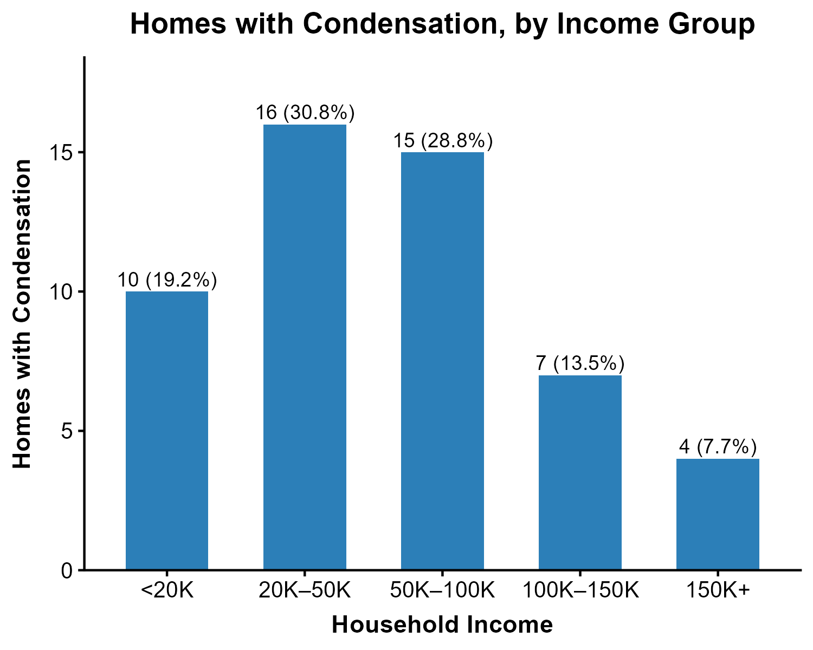

```{r setup, include=FALSE}
knitr::opts_chunk$set(
  echo = FALSE,       # hides code
  message = FALSE,    # suppresses messages
  warning = FALSE     # suppresses warnings
)
```


## 3.2 Condensation problems by Income Group 

54 participants had homes with condensation problems, while 1348 participants did not. The following figure shows the income distribution of participants who had condensation problems. 

```{r figure_condensation, echo=FALSE, fig.width=5,fig.height=3,out.width="80%",fig.cap="Figure X: Number of homes with condensation by household income group"}

```
