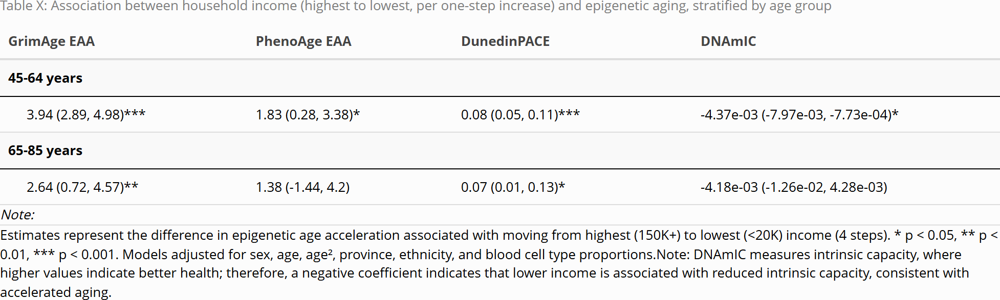
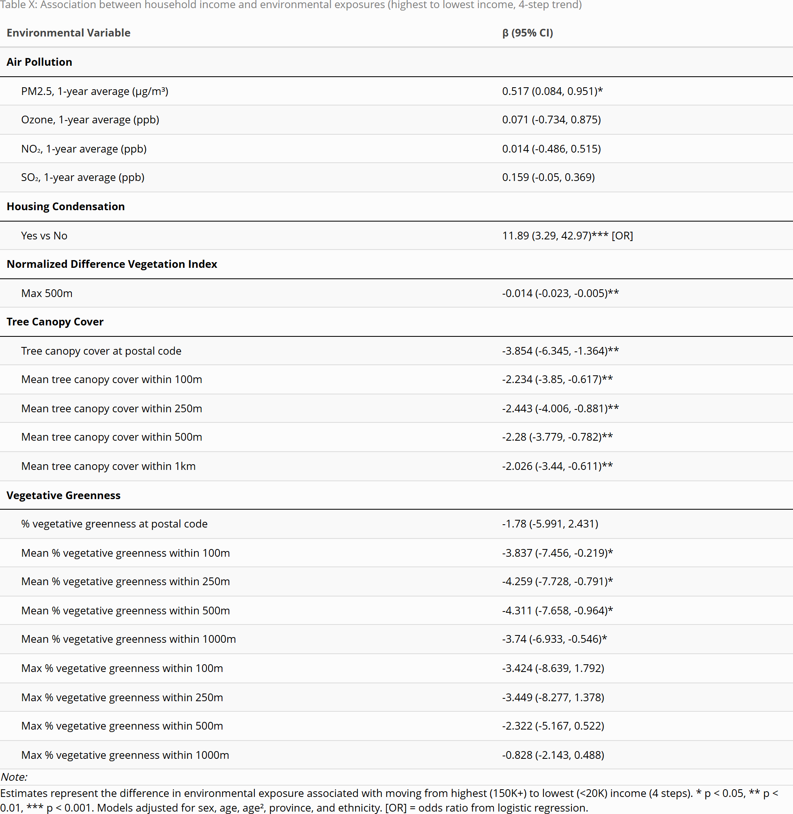
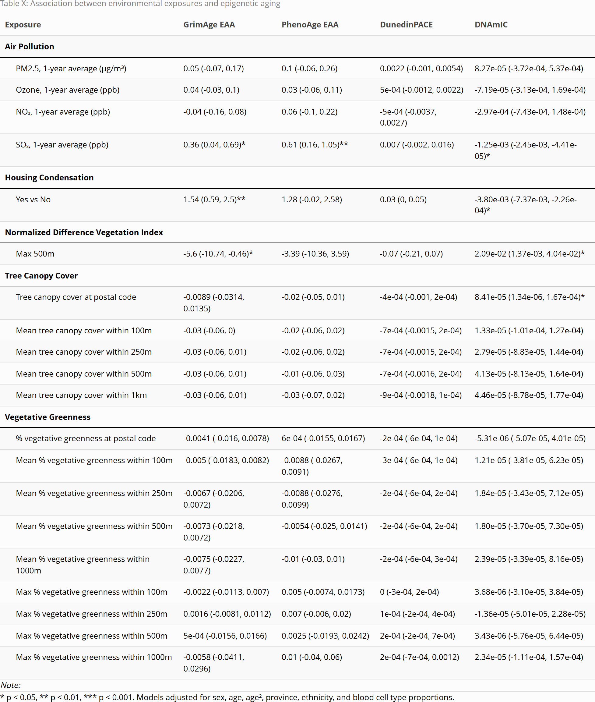

```{r, echo = FALSE, warning = FALSE}
library(knitr)
knitr::opts_chunk$set(
  dpi = 300
)
```


METHODS

# Study Design

Data were drawn from the Canadian Longitudinal Study on Aging (CLSA), a national, long-term cohort study that follows Canadian adults to understand biological, medical, psychological, social, and economic aspects of aging [@rainaCohortProfileCanadian2019]. Participants were eligible if they were aged 45–85 years at enrolment and residing in one of the 10 Canadian provinces. The CLSA is composed of two cohorts: a Tracking cohort of 21,241 participants interviewed by telephone, and a Comprehensive cohort of 30,097 participants who were both interviewed in-home, and had physical examinations and biological specimens collected at 11 data collection sites. Baseline data collection occurred from 2011 to 2015, and follow up data collection has been occurring every 3 years. 

At baseline, all participants completed questionnaire-based assessments covering sociodemographic, lifestyle, and health-related information. Comprehensive cohort participants additionally underwent physical measurements and provided blood and urine samples at one of eleven data collection sites located across seven provinces. 

# Study population

The current analysis focuses on a subset of Comprehensive cohort participants selected for genome-wide DNA methylation (DNAm) profiling at baseline. Of the 30,097 participants enrolled in the CLSA Comprehensive cohort at baseline, 23,492 had provided blood and urine samples with available EDTA whole blood and Buffy coat. From this group, 10,000 participants were selected for genomics and metabolomics analyses: 3,000 from the 6,268 participants who had fasted for five or more hours, and 7,000 from the remaining non-fasting participants. A sub-sample of 1,500 participants was subsequently selected from this pool for epigenetic analysis. All sample selections were made to reflect the distribution of the Comprehensive cohort by age, sex, and data collection site, rather than through random selection. Of the 1,500 selected for epigenetic analysis, 1,478 were successfully assayed for DNA methylation, and 1,445 passed stringent quality control assessments and were included in the final analytic sample [@zotero-item-786].

# Measures 

## Biological Aging Outcomes

Four DNA methylation-based epigenetic measures were used as outcome measures, each trained to capture distinct aspects of biological aging. PhenoAge was trained on a composite of nine clinical biomarkers of aging-related disease mortality (including heart disease, cancer, chronic respiratory disease, cerebrovascular disease, Alzheimer's disease, diabetes, and kidney disease) and chronological age, and is a strong predictor of phenotypic age and mortality risk [@levineEpigeneticBiomarkerAging2018].GrimAge was trained to predict seven plasma proteins related to aging-related morbidity and mortality risk and smoking pack-years, and is a strong predictor of time-to-death and disease risk [@luDNAMethylationGrimAge2019].
DunedinPACE was trained on 19 biomarkers of organ-system integrity, measured across four time points over 20 years to capture the rate of biological decline, providing a measure of the pace of aging rather than a biological age estimate [@belskyDunedinPACEDNAMethylation2022]. DNAm Intrinsic Capacity is a novel measure that was trained to predict an intrinsic capacity score based on five factors: cognition, locomotion, psychology, sensory ability, and vitality. This measure predicts functional decline and mortality [@fuentealbaBloodbasedEpigeneticClock2025a]. In contrast to the epigenetic age acceleration measures (PhenoAge, GrimAge, and DunedinPACE), for which higher values indicate faster biological aging, higher DNAmIC indicates better functional status.


## Socioeconomic Conditions

Total household income was used as an indicator of socioeconomic conditions. Participants were asked to report their best estimate of total household income received by all household members, from all sources, before taxes and deductions, in the past 12 months. Income was categorized into five groups: less than $20,000; $20,000 to less than $50,000; $50,000 to less than $100,000; $100,000 to less than $150,000; and $150,000 or more. Participants who responded "don't know," refused to respond, or provided no answer were retained in the analysis and classified as separate categories.


## Environmental Exposures

Environmental exposures included air pollution, housing condensation, vegetative greenness fraction, tree canopy cover, and Normalized Difference Vegetation Index (NDVI), a greenness index. Air pollution, tree canopy cover, and greenness measures are from the Canadian Urban Environmental Health Research Consortium (CANUE) and are linked to CLSA data [@CLSALinksCANUE2018].

Annual average PM2.5 concentration in micrograms per cubic meter (µg/m³) was obtained from the CANUE data portal and linked to participant postal codes [@canueDataPortal]. Values are from the V5.GL.03 dataset (1998–2021), which uses satellite-derived aerosol data combined with the GEOS-Chem chemical transport model, calibrated to ground-based observations. This dataset was preferred over estimates derived from National Air Pollution Surveillance (NAPS) monitoring stations because it provides complete and consistent spatial coverage across all participants.

Annual average O~3~, measured in parts per billion (ppb), was obtained from the CANUE data portal and is linked to postal code [@canueDataPortal]. It represents a one-year average of ground-level observations modeled by Environment and Climate Change Canada using the CHRONOS model (2002–2009) and GEM-MACH model (2010–2024).

No postal code-linked NO~2~ measure from CANUE was available for the baseline data collection period. Therefore, a one-year average NO~2~ concentration (ppb) derived from National Air Pollution Surveillance (NAPS) monitoring stations within 50 km of each participant's postal code was used.

Similarly, no one-year average SO~2~ measure linked to postal code was available. A one-year average SO~2~ concentration (ppb) derived from NAPS stations within 50 km was therefore used as the SO~2~ measure.

Tree canopy cover refers to the percentage of area covered by woody plants taller than 5 metres. Estimates were derived from Landsat satellite imagery (30m resolution) via Google Earth Engine for 2010 and 2015, and averaged within buffers of 100, 250, 500, and 1000 metres around each postal code [@canueDataPortal].

Vegetative greenness fraction measures the proportion of green vegetation visible within each 30 m by 30 m pixel, derived from Landsat imagery spanning 1984–2016. Because the measure captures everything within a pixel, the presence of roads, buildings, and other built structures can reduce greenness values even in areas with tree cover, making it a broader indicator of urban vegetation rather than canopy alone. Annual mean and maximum values were assigned to postal codes within buffers of 100, 250, 500, and 1000 metres around each postal code centroid [@canueDataPortal].

NDVI (Normalized Difference Vegetation Index) is a satellite-derived measure of vegetation density, calculated from the difference between near-infrared and red light reflectance. The measure used here represents the maximum annual NDVI value within a 500m buffer around each postal code, derived from Landsat imagery [@canueDataPortal].

Condensation problems were assessed via a yes/no questionnaire item: "Does your current home have problems with condensation?"


\newpage


RESULTS

The mean age was 63 years (SD = 10), and the sample was approximately evenly split by sex (49% male, 51% female). The majority of participants self-reported their ethnicity as White (95%). Participants were drawn from seven provinces, with the largest proportions from British Columbia (21%), Ontario (21%), and Quebec (20%); New Brunswick, Prince Edward Island, and Saskatchewan had no participants in the epigenetic subsample. The most common household income category was $50,000–$100,000 (31%), and 6.4% reported household income below $20,000.

Air pollutant concentrations were generally low: Mean PM2.5 was 6.66 µg/m³ (SD = 1.79), mean O3 was 25.3 ppb (SD = 4.3), mean NO2 was 8.5 ppb (SD = 3.0), and mean SO2 was 1.01 ppb (SD = 0.81). SO2 and NO2 had the highest rates of missing data (21% and 14%, respectively). In terms of green space, mean NDVI was 0.81 (SD = 0.04), and tree canopy coverage averaged 16% at the postal code level and approximately 32% within larger buffers. Vegetative greenness increased with buffer size, ranging from a mean of 28% at the postal code level to a maximum of 96.3% within 1km. Few participants (3.9%) reported housing condensation problems.

```{r table_demographics, echo=FALSE, out.width="100%"}

```


\newpage


# Income predicting accelerated aging

Table X shows the association between household income and epigenetic aging, separately for the 45–64 and 65–85 age groups. To examine this association, income categories were assigned numeric values from 1 (highest, ≥150K) to 5 (lowest, <20K) and entered into the model as a continuous trend variable, such that a positive coefficient reflects greater epigenetic aging with decreasing income.For DNAmIC, which measures intrinsic capacity where higher values indicate better health, a negative coefficient instead reflects reduced intrinsic capacity with decreasing income.

In the younger age group (45–64 years), lower income was associated with faster epigenetic aging across all four measures. Moving from the highest (≥150K) to the lowest (<20K) income category was associated with a GrimAge EAA that was 3.94 years higher (95% CI: 2.89, 4.98, p < 0.001), a PhenoAge EAA that was 1.83 years higher (95% CI: 0.28, 3.38, p < 0.05), and a DunedinPACE that was 0.08 faster (95% CI: 0.05, 0.11, p < 0.001). DNAmIC was also significantly lower in those with lower income (β = -4.37e-03, 95% CI: -7.97e-03, -7.73e-04, p < 0.05), suggesting reduced intrinsic capacity.

In the older age group (65–85 years), the associations were weaker. GrimAge EAA was 2.64 years higher (95% CI: 0.72, 4.57, p < 0.01) and DunedinPACE was 0.07 faster (95% CI: 0.01, 0.13, p < 0.05) moving from the highest to the lowest income category, but PhenoAge EAA and DNAmIC were no longer significant.

It should be noted that income categories were treated as equally spaced numeric steps in this analysis. However, the difference between adjacent income categories may not be equivalent For example, the gap between <20K and 20–50K could have a different impact on health than the gap between 100–150K and 150K+. The assumption of equal spacing is a limitation of the trend analysis approach.


<br>
<br>

```{r table_income, echo=FALSE, out.width="100%"}

```


\newpage

# Income predicting environmental exposures

Table X presents the association between household income and environmental exposures, comparing the highest (≥150K) to the lowest (<20K) income category. In terms of air pollution, lower income was associated with higher PM2.5 concentrations (β = 0.52, 95% CI: 0.08, 0.95, p < 0.05), while ozone, NO₂, and SO₂ were not significantly associated with income. Lower income was also associated with lower NDVI (β = -0.01, 95% CI: -0.02, -0.005, p < 0.01). Additionally, lower income was associated with greater odds of housing condensation (OR = 11.89, 95% CI: 3.29, 42.97, p < 0.001).

With respect to green space, lower income was consistently associated with less tree canopy cover across all buffer sizes. Moving from the highest to the lowest income category was associated with a reduction of 3.85 percentage points of tree canopy cover at the postal code level (95% CI: -6.35, -1.36, p < 0.01), with similar reductions observed within 100m to 1km buffers (range: 2.03 to 2.44 percentage points, all p < 0.01).

Similarly, mean % vegetative greenness was significantly lower among those with lower income within 100m to 1000m buffers (range: 3.74 to 4.31 percentage points, all p < 0.05), though maximum vegetative greenness and vegetative greenness at the postal code level were not statistically significant.


<br>
<br>


```{r table_env_income, echo=FALSE, out.width="100%"}

```


\newpage

# Environment predicting accelerated aging

Table X presents the associations between environmental exposures and epigenetic aging. With respect to air pollution, higher SO₂ concentrations were associated with accelerated GrimAge EAA (β = 0.36, 95% CI: 0.04, 0.69, p < 0.05) and PhenoAge EAA (β = 0.61, 95% CI: 0.16, 1.05, p < 0.01), as well as reduced DNAmIC (β = -1.25e-03, 95% CI: -2.45e-03, -4.41e-05, p < 0.05). PM2.5, ozone, and NO₂ were not significantly associated with any epigenetic aging measure.

Housing condensation was associated with higher GrimAge EAA (β = 1.54, 95% CI: 0.59, 2.5, p < 0.01) and reduced DNAmIC (β = -3.80e-03, 95% CI: -7.37e-03, -2.26e-04, p < 0.05), but was not significantly associated with PhenoAge EAA or DunedinPACE.

Higher NDVI (max within 500m) was associated with lower GrimAge EAA (β = -5.6, 95% CI: -10.74, -0.46, p < 0.05) and higher DNAmIC (β = 2.09e-02, 95% CI: 1.37e-03, 4.04e-02, p < 0.05), suggesting that greater greenspace was associated with less epigenetic aging. Tree canopy cover at the postal code level was significantly associated with higher DNAmIC only (β = 8.41e-05, 95% CI: 1.34e-06, 1.67e-04, p < 0.05), while mean and max vegetative greenness were not significantly associated with any epigenetic aging outcome.


<br>
<br>


```{r table_env_aging, echo=FALSE, out.width="100%"}

```


\newpage

# References


