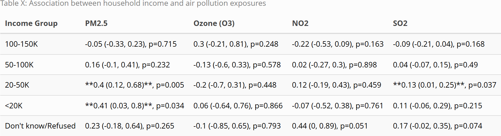
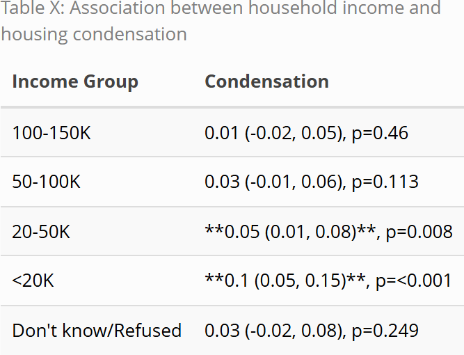
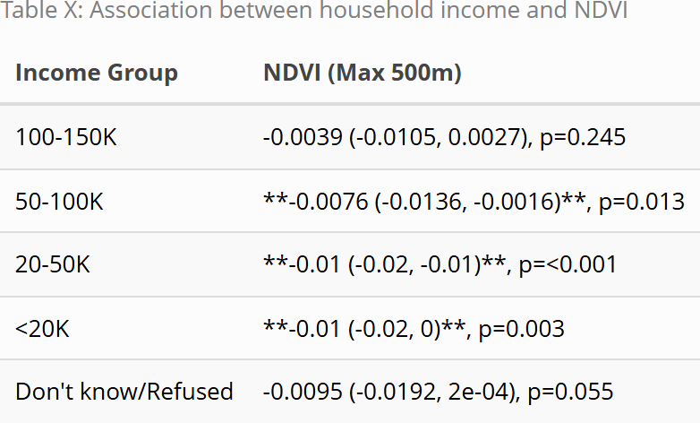
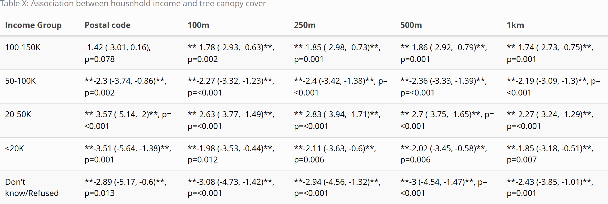
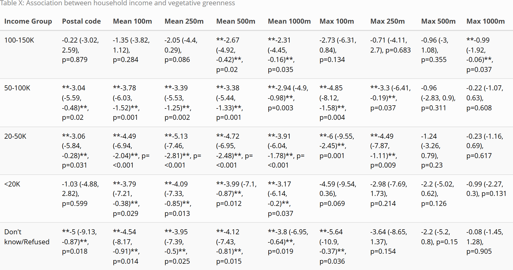
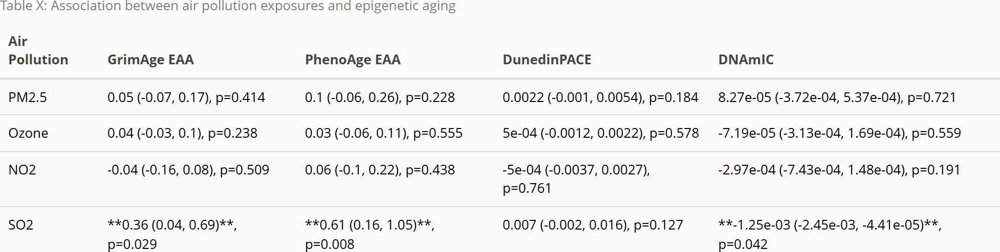
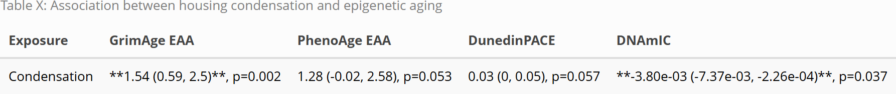
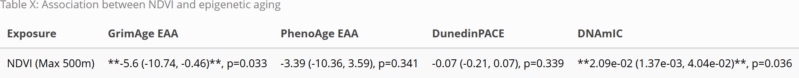
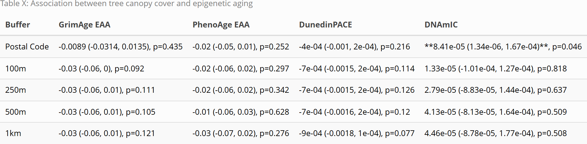
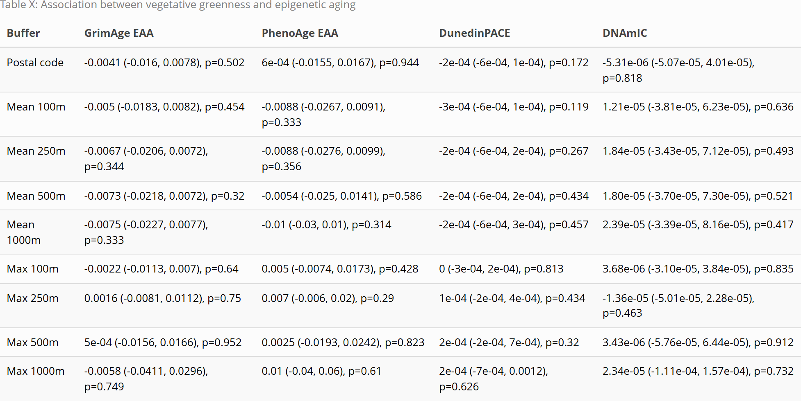

```{r, echo = FALSE, warning = FALSE}
library(knitr)
knitr::opts_chunk$set(
  dpi = 300
)
```


METHODS

# Study Design

Data were drawn from the Canadian Longitudinal Study on Aging (CLSA), a national, long-term cohort study that follows Canadian adults to understand biological, medical, psychological, social, and economic aspects of aging [@rainaCohortProfileCanadian2019]. Participants were eligible if they were aged 45–85 years at enrolment and residing in one of the 10 Canadian provinces. The CLSA is composed of two cohorts: a Tracking cohort of 21,241 participants interviewed by telephone, and a Comprehensive cohort of 30,097 participants who were both interviewed in-home, and had physical examinations and biological specimens collected at 11 data collection sites. Baseline data collection occurred from 2011 to 2015, and follow up data collection has been occurring every 3 years. 

At baseline, all participants completed questionnaire-based assessments covering sociodemographic, lifestyle, and health-related information. Comprehensive cohort participants additionally underwent physical measurements and provided blood and urine samples at one of eleven data collection sites located across seven provinces. 

# Study population

The current analysis focuses on a subset of Comprehensive cohort participants selected for genome-wide DNA methylation (DNAm) profiling at baseline. Of the 30,097 participants in the Comprehensive cohort at baseline, 23,492 had provided blood samples with available EDTA whole blood and buffy coat. From this group, 10,000 participants were selected for genomics and metabolomics analyses, of whom 1,500 were subsequently selected for epigenetic profiling. DNAm was successfully assayed in 1,478 of these participants using the Illumina Infinium MethylationEPIC BeadChip microarray, which provides quantitative measurements of DNA methylation across 865,918 total genomic sites. All sample selections were made to reflect the distribution of the Comprehensive cohort by age, sex, and data collection site. 

# Measures 

## Biological Aging Outcomes

Four DNA methylation-based epigenetic measures were used as outcome measures, each trained to capture distinct aspects of biological aging. PhenoAge was trained on a composite of nine clinical biomarkers and chronological age, and predicts phenotypic age and mortality risk [@levineEpigeneticBiomarkerAging2018]. GrimAge was trained to predict seven plasma proteins and smoking pack-years, and is a strong predictor of time-to-death and disease risk [@luDNAMethylationGrimAge2019].
DunedinPACE was trained on 19 biomarkers measured across four time points over 20 years to capture the rate of biological decline, providing a measure of the pace of aging rather than a biological age estimate [@belskyDunedinPACEDNAMethylation2022]. DNAm Intrinsic Capacity is a novel measure that was trained to predict an intrinsic capacity score based on five factors: cognition, locomotion, psychology, sensory ability, and vitality. This measure predicts functional decline and mortality [@fuentealbaBloodbasedEpigeneticClock2025a]. In contrast to the epigenetic age acceleration measures (PhenoAge, GrimAge, and DunedinPACE), for which higher values indicate faster biological aging, higher DNAmIC indicates better functional status.


## Socioeconomic Conditions

Total household income was used as an indicator of socioeconomic conditions. Participants were asked to report their best estimate of total household income received by all household members, from all sources, before taxes and deductions, in the past 12 months. Income was categorized into five groups: less than $20,000; $20,000 to less than $50,000; $50,000 to less than $100,000; $100,000 to less than $150,000; and $150,000 or more. Participants who responded "don't know," refused to respond, or provided no answer were retained in the analysis and classified as separate categories.


## Environmental Exposures

Environmental exposures included air pollution, housing condensation, vegetative greenness fraction, tree canopy cover (TCC), and Normalized Difference Vegetation Index (NDVI), a greenness index. Air pollution, TCC, and greenness measures are from the Canadian Urban Environmental Health Research Consortium (CANUE) and are linked to CLSA data [@CLSALinksCANUE2018].

Annual average PM2.5 concentration in micrograms per cubic meter (µg/m³) was obtained from the CANUE data portal and linked to participant postal codes [@canueDataPortal]. Values are from the V5.GL.03 dataset (1998–2021), which uses satellite-derived aerosol data combined with the GEOS-Chem chemical transport model, calibrated to ground-based observations. This dataset was preferred over estimates derived from National Air Pollution Surveillance (NAPS) monitoring stations because it provides complete and consistent spatial coverage across all participants.

Annual average O~3~, measured in parts per billion (ppb), was obtained from the CANUE data portal and is linked to postal code [@canueDataPortal]. It represents a one-year average of ground-level observations modeled by Environment and Climate Change Canada using the CHRONOS model (2002–2009) and GEM-MACH model (2010–2024).

No postal code-linked NO~2~ measure from CANUE was available for the baseline data collection period. Therefore, a one-year average NO~2~ concentration (ppb) derived from National Air Pollution Surveillance (NAPS) monitoring stations within 50 km of each participant's postal code was used.

Similarly, no one-year average SO~2~ measure linked to postal code was available. A one-year average SO~2~ concentration (ppb) derived from NAPS stations within 50 km was therefore used as the SO~2~ measure.

TCC refers to the percentage of area covered by woody plants taller than 5 metres. Estimates were derived from Landsat satellite imagery (30m resolution) via Google Earth Engine for 2010 and 2015, and averaged within buffers of 100, 250, 500, and 1000 metres around each postal code [@canueDataPortal].

Vegetative greenness fraction measures the proportion of green vegetation visible within each 30 m by 30 m pixel, derived from Landsat imagery spanning 1984–2016. Because the measure captures everything within a pixel, the presence of roads, buildings, and other built structures can reduce greenness values even in areas with tree cover, making it a broader indicator of urban vegetation rather than canopy alone. Annual mean and maximum values were assigned to postal codes within buffers of 100, 250, 500, and 1000 metres around each postal code centroid [@canueDataPortal].

NDVI (Normalized Difference Vegetation Index) is a satellite-derived measure of vegetation density, calculated from the difference between near-infrared and red light reflectance. The measure used here represents the maximum annual NDVI value within a 500m buffer around each postal code, derived from Landsat imagery [@canueDataPortal].

Condensation problems were assessed via a yes/no questionnaire item: "Does your current home have problems with condensation?"


\newpage


RESULTS

The analytic sample consisted of 1,478 CLSA Comprehensive cohort participants with available DNA methylation data. The mean age was 63 years (SD = 10), and the sample was approximately evenly split by sex (49% male, 51% female). The majority of participants self reported their ethnicity as White (95%). Participants were drawn from seven provinces, with the largest proportions from British Columbia (21%), Ontario (21%), and Quebec (20%); New Brunswick, Prince Edward Island, and Saskatchewan had no participants in the epigenetic subsample. The most common household income category was $50,000–$100,000 (31%), and 6.4% reported household income below $20,000.

Mean PM2.5 was 6.66 µg/m³ (SD = 1.79), mean O~3~ was 25.3 ppb (SD = 4.3), mean NO~2~ was 8.5 ppb (SD = 3.0), and mean SO~2~ was 1.01 ppb (SD = 0.81). Missing data were highest for SO~2~ (21%) and NO~2~ (14%). Mean NDVI was 0.81 (SD = 0.04). A small proportion of participants (3.9%) reported housing condensation problems. TCC averaged 16% at the postal code level and approximately 32% within larger buffers. Vegetative greenness increased with buffer size, ranging from a mean of 28% at the postal code level to a maximum of 96.3% within 1km.


```{r table_demographics, echo=FALSE, out.width="50%"}

```

<br>
<br>


```{r table_SES, echo=FALSE, out.width="50%"}

```

<br>
<br>


```{r table_aging, echo=FALSE, out.width="50%"}

```

<br>
<br>


```{r table_pollution, echo=FALSE, out.width="50%"}

```

<br>
<br>


```{r table_greenness, echo=FALSE, out.width="50%"}

```

<br>
<br>


\newpage


# Income predicting accelerated aging

Due to a significant interaction between age and income, age was stratified into two groups. Lower household income was associated with accelerated epigenetic aging across multiple epigenetic aging measures, with associations most pronounced among adults aged 45–64. In this age group, a clear dose-response pattern emerged for GrimAge EAA and DunedinPACE, whereby each successively lower income bracket showed greater biological age acceleration relative to the highest income group: 50–100K (GrimAge: β = 1.04, 95% CI: 0.38 to 1.70, p = 0.002; DunedinPACE: β = 0.03, 95% CI: 0.01 to 0.05, p = 0.001), 20–50K (GrimAge: β = 2.46, 95% CI: 1.68 to 3.23, p < 0.001; DunedinPACE: β = 0.06, 95% CI: 0.04 to 0.08, p < 0.001), and <20K (GrimAge: β = 3.75, 95% CI: 2.65 to 4.84, p < 0.001; DunedinPACE: β = 0.08, 95% CI: 0.05 to 0.10, p < 0.001). The lowest income group also showed significant PhenoAge acceleration (β = 1.53, 95% CI: 0.08 to 2.97, p = 0.038). Lower-income groups also showed significantly reduced DNAmIC across multiple income brackets, indicating lower intrinsic capacity (50–100K: β = −2.22×10⁻³, p = 0.042; 20–50K: β = −3.84×10⁻³, p = 0.003; <20K: β = −3.84×10⁻³, p = 0.033).

Among adults aged 65–85, income-associated differences in epigenetic aging were attenuated. Significant associations were confined to the lowest income groups, with the <20K group showing elevated GrimAge EAA (β = 2.74, 95% CI: 1.26 to 4.22, p < 0.001) and faster DunedinPACE (β = 0.06, 95% CI: 0.02 to 0.10, p = 0.003), and the 20–50K group showing a significant GrimAge association (β = 1.48, 95% CI: 0.33 to 2.63, p = 0.012), while other epigenetic measures and income groups did not reach significance.

<br>
<br>

```{r table_income, echo=FALSE, out.width="100%"}
knitr::include_graphics("Figures/income_epigenetic_table.png")
```


Note: Reference category: $150,000+. Results are beta coefficients and 95% CI from linear regression models adjusted for sex, age, age-squared, province, ethnicity, and cell type composition. ** indicates p<0.05. GrimAge EAA = GrimAge epigenetic age acceleration; PhenoAge EAA = PhenoAge epigenetic age acceleration; DunedinPACE = pace of biological aging; DNAmIC = DNA methylation intrinsic capacity.


\newpage

# Income predicting environmental exposures

For air pollution, lower-income groups showed significantly higher PM2.5 exposure, with the 20–50K (β = 0.40, 95% CI: 0.12 to 0.68, p = 0.005) and <20K (β = 0.41, 95% CI: 0.03 to 0.80, p = 0.034) groups both reaching significance relative to the highest income group. SO2 was also elevated in the 20–50K group (β = 0.13, 95% CI: 0.01 to 0.25, p = 0.037). Ozone and NO2 did not differ significantly across income groups.

Lower household income was associated with a significantly higher probability of housing condensation, with the association most pronounced in the lowest income groups. The 20–50K (β = 0.05, 95% CI: 0.01 to 0.08, p = 0.008) and <20K (β = 0.10, 95% CI: 0.05 to 0.15, p < 0.001) groups showed significantly higher rates of condensation relative to the highest income group. No significant associations were observed for the 100–150K or 50–100K groups.

Lower-income groups showed progressively reduced NDVI (greenness index), with the 50–100K (β = −0.0076, 95% CI: −0.0136 to −0.0016, p = 0.013), 20–50K (β = −0.01, 95% CI: −0.02 to −0.01, p < 0.001), and <20K (β = −0.01, 95% CI: −0.02 to 0, p = 0.003) groups all showing significantly lower NDVI values relative to the highest-earning households.

For the association between household income and TCC, effect sizes varied slightly across spatial buffers, and while a clear income gradient was observed across most groups, the <20K group did not follow this pattern consistently, though all associations remained statistically significant.

For the association between household income and % vegetative greenness, effect sizes varied slightly across spatial buffers, and while a clear income gradient was observed across most groups, again the <20K group did not follow this pattern (i.e. there were smaller and sometimes non-significant effects in the <20K group compared to the 20–50K group). 

<br>
<br>


```{r table_airpollution, echo=FALSE, out.width="100%"}

```

<br>
<br>

```{r table_condensation, echo=FALSE, out.width="100%"}

```


<br>
<br>

```{r table_income_NDVI, echo=FALSE, out.width="100%"}

```

<br>
<br>


```{r table_treecanopy, echo=FALSE, out.width="100%"}

```


<br>
<br>


```{r table_income_greenness, echo=FALSE, out.width="100%"}

```


\newpage

# Environment predicting accelerated aging

For the association between air pollution exposures and epigenetic aging measures, most pollutants were not significantly associated with the epigenetic measures. However, SO2 showed significant associations, with higher SO2 exposure associated with increased GrimAge (β = 0.36, 95% CI: 0.04 to 0.69, p = 0.029) and PhenoAge EAA (β = 0.61, 95% CI: 0.16 to 1.05, p = 0.008), while an inverse association was observed with DNAmIC (β = −1.25×10⁻³, 95% CI: −2.45×10⁻³ to −4.41×10⁻⁵, p = 0.042). No significant associations were observed for DunedinPACE.

For the association between housing condensation and epigenetic aging measures, most outcomes were not significantly associated with condensation. However, condensation showed a significant positive association with GrimAge EAA (β = 1.54, 95% CI: 0.59 to 2.50, p = 0.002), while a significant inverse association was observed with DNAmIC (β = −3.80×10⁻³, 95% CI: −7.37×10⁻³ to −2.26×10⁻⁴, p = 0.037). No significant associations were observed for PhenoAge or DunedinPACE.

For the association between NDVI and epigenetic aging measures, most outcomes were not significantly associated with NDVI. However, NDVI showed a significant inverse association with GrimAge EAA (β = −5.60, 95% CI: −10.74 to −0.46, p = 0.033), while a significant positive association was observed with DNAmIC (β = 2.09×10⁻², 95% CI: 1.37×10⁻³ to 4.04×10⁻², p = 0.036). No significant associations were observed for PhenoAge or DunedinPACE.

For the association between TCC and epigenetic aging measures, most outcomes were not significantly associated with TCC across any buffer size. The only significant association observed was between postal code-level TCC and DNAmIC (β = 8.41×10⁻⁵, 95% CI: 1.34×10⁻⁶ to 1.67×10⁻⁴, p = 0.046). No significant associations were observed for GrimAge, PhenoAge, or DunedinPACE at any buffer size.

For the association between vegetative greenness and epigenetic aging measures, no significant associations were observed across any buffer size or epigenetic measure.

<br>
<br>

```{r table_airpollution_aging, echo=FALSE, out.width="100%"}

```

<br>
<br>


```{r table_condensation_aging, echo=FALSE, out.width="100%"}

```


<br>
<br>

```{r table_NDVI_aging, echo=FALSE, out.width="100%"}

```

<br>
<br>


```{r table_treecanopycoverage_aging, echo=FALSE, out.width="100%"}

```

<br>
<br>

```{r table_greenness_aging, echo=FALSE, out.width="100%"}

```


<br>
<br>


\newpage

# References


