```{r, echo = FALSE, warning = FALSE}
library(knitr)
knitr::opts_chunk$set(
  dpi = 300
)
```

\newpage

# 1 Description of Study and Sample 

## CLSA and CANUE data  

The Canadian Longitudinal Study on Aging (CLSA) is a longitudinal cohort study that recruited 51,338 community-based individuals (n = 30,097 Comprehensive cohort and n = 21,241 Tracking cohort) aged 45–85 years [@rainaCohortProfileCanadian2019]. It excludes people living in nursing homes, on First Nations reserves, and in the Canadian territories, full-time members of the armed forces, people unable to respond in English or French, and people with significant cognitive impairment precluding participation without a proxy respondent. 
The participants for the comprehensive cohort were recruited from within 25–50 km of 11 data collection sites across 7 Canadian provinces: British Columbia (Surrey, Victoria, Vancouver), Alberta (Calgary), Manitoba (Winnipeg), Ontario (Hamilton, Ottawa), Quebec (Montréal, Sherbrooke), Nova Scotia (Halifax) and Newfoundland and Labrador (St. John). They were interviewed in person and had physical assessments done, and provided blood and urine samples.

The environmental variables come from the Canadian Urban Environmental Health Research Consortium (CANUE), an initiative to collect and develop standard measures for environmental exposure data and link them to health databases in Canada. The CLSA and CANUE collaborated in 2018 to link data to provide information on environmental factors that may influence aging. The linked CANUE data include estimated exposures of sulfur dioxide, nitrogen dioxide, ozone and fine particulate matter, nighttime light, normalized difference vegetation index (i.e. greenness), weather and climate ([CLSA, 2018](https://www.clsa-elcv.ca/clsa-links-with-canue-to-release-data-on-environmental-health-cihr-announces-funding-opportunity/)).


## DNA methylation data 

For DNA methylation profiling, 23,492 Comprehensive cohort participants provided baseline blood and urine samples, including EDTA whole blood and buffy coat [@zotero-item-786]. Of these, 6,268 had fasted for at least 5 hours, and 3,000 of them were selected for genomics and metabolomics analyses. Additionally, from the remaining 20,492 participants, 7,000 were selected. From these 10,000 participants, a sub-sample of 1,500 was chosen for epigenetic analysis, of which 1,478 were successfully assayed. Sample selections were made to match the distribution of Comprehensive cohort by age, sex, and data collection site (Lin et al. 2022). 

DNAm PhenoAge was calculated following the method described by Levine et al. (reference). DNA methylation β‑values (percent methylation) were obtained for each of the 513 CpG sites included in the PhenoAge model. Each β‑value was multiplied by its corresponding weight from Levine’s model, and the weighted values were then summed. The intercept from the model was added to this sum, resulting in the DNAm PhenoAge estimate in years. 

Epigenetic age acceleration (EAA) for DNAm PhenoAge was then calculated using a linear regression of DNAm PhenoAge (dependent variable) on chronological age (independent variable). The residuals from this regression represent EAA: a positive residual means an individual’s epigenetic age is higher than expected for their chronological age (faster aging), while a negative residual means it is lower than expected (slower aging). Because the regression is done within this specific study group, EAA values show how an individual’s aging compares to others in the same cohort.

# 2 Descriptive Statistics


## Missing data 

```{r table_missing, echo=FALSE, out.width="80%"}
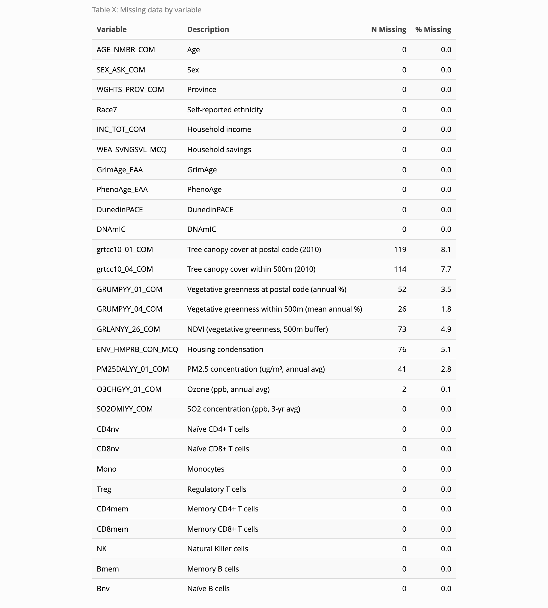
```

```{r figure_missing, echo=FALSE, fig.width=14, fig.height=9, out.width="100%", fig.cap="Figure X: Missing data pattern across study variables"}
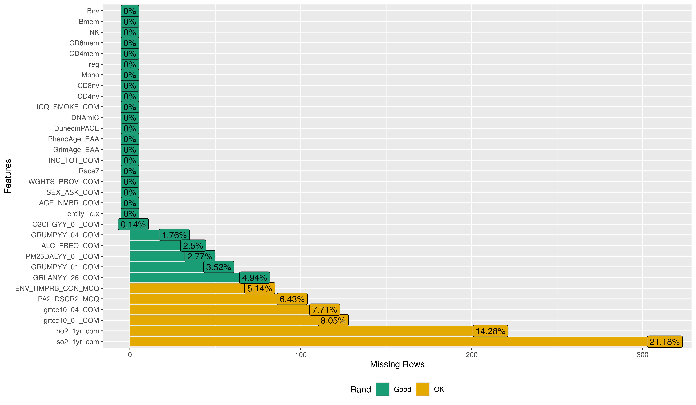
```


## Demographics: Age, sex, and ethnicity 

Participants were 49.5% male and 50.5% female. The median age was 62 years old. The majority of participants self-reported their cultural background as White (95%). 

```{r figure_ethnicity, echo=FALSE, fig.width=5,fig.height=3,out.width="80%",fig.cap="Figure X: Participant's self-reported cultural background."}
knitr::include_graphics("Figures/ethnicity_barplot.png")
```

<br>
<br>

Distribution across provinces was as follows:

```{r table_province, echo=FALSE, fig.width=8,fig.height=5,out.width="100%"}
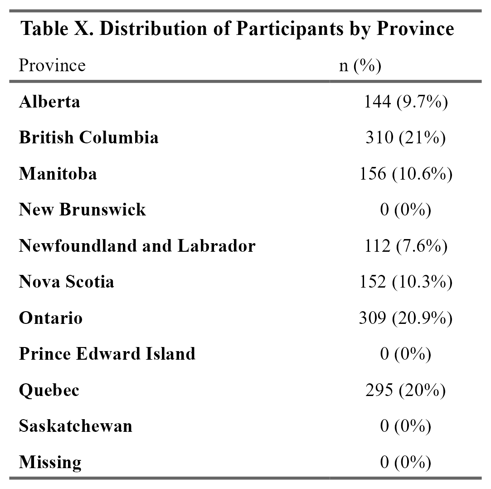
```


\newpage

## Socioeconomic conditions: Household income and savings 

Household income was most commonly reported in the \$50,000–\$99,999 range (31.0%), followed by \$20,000–\$49,999 (24.6%), \$100,000–\$149,999 (16.8%), and \$150,000 or more (15.9%). Smaller proportions reported incomes below \$20,000 (6.4%), or did not report income (5.3%).

```{r figure_income, echo=FALSE, fig.width=5,fig.height=3,out.width="80%",fig.cap="Figure X: Estimate of total household income received by all household members, from all sources, before taxes and deductions, in the past 12 months."}
knitr::include_graphics("Figures/household_income_barplot.png")
```

\newpage

Savings and investment levels varied across participants. The most commonly reported category was \$100,000 to less than \$1 million (40.2%), followed by less than \$50,000 (21.4%) and \$50,000–\$100,000 (13.0%). Smaller proportions reported savings of \$1 million or more (9.5%) or selected Don't know/No answer/Refused (8.9%), while 7.0% of savings data were missing.

```{r figure_savings, echo=FALSE, fig.width=5,fig.height=3,out.width="80%",fig.cap="Figure X: Approximate total value of savings and investments, including bank accounts, RRSPs, and financial investments."}
knitr::include_graphics("Figures/savings_barplot.png")
```


## Environmental Exposure variables 

### Air pollution measures 

The following plots show the differences between linked data from CANUE vs. annual averages of NAPs locations. 

PM2.5 (Fine Particulate Matter)
pm25_1yr_com is the one-year average PM2.5 concentration (µg/m³) prior to each participant's first interview date, calculated as averages of National Air Pollution Surveillance station (NAPS) locations within 50 km. PM25DALYY_01_COM is a postal code-level annual average derived from the V5.GL.03 satellite dataset (1998–2021), which combines Aerosol Optical Depth retrievals from NASA's MODIS, MISR, and SeaWiFS instruments with the GEOS-Chem chemical transport model, calibrated to ground observations via Geographically Weighted Regression. The key differences are that pm25_1yr_com is anchored to each participant's interview date and station-based, while PM25DALYY_01_COM is a modelled, fixed annual postal code estimate. 

Ozone (O3)
o3_1yr_com is the one-year average ozone concentration prior to each participant's first interview date, calculated from NAPS stations within 50 km. O3CHGYY_01_COM is a postal code-level annual average modelled by  Environment and Climate Change Canada using CHRONOS Canadian Hemispherical Regional Ozone and NOx System model from 2002–2009, and Global Environmental Multi-scale Modelling Air Quality and Chemistry (GEM-MACH) model from 2010 to 2024. These estimates  incorporate ground-level observations, and reported only where data completeness thresholds are met. The key differences are that o3_1yr_com is anchored to each participant's interview date and station-based, while O3CHGYY_01_COM is a modelled, fixed annual postal code estimate. 

SO2 (Sulfur Dioxide)
so2_1yr_com is the one-year average SO2 concentration prior to each participant's first interview date, calculated from NAPS stations within 50 km. SO2OMIYY_COM is a postal code-level three-year running average (ppb) derived from  Ozone Monitoring Instrument (OMI) satellite data combined with GEM-MACH model profiles, covering 2007–2015, where each value represents the average of the labelled year and the two preceding years. The key differences are that so2_1yr_com is anchored to each participant's interview date and station-based, while SO2OMIYY_COM is a satellite- and model-derived fixed estimate smoothed over three years. 


NO2 (Nitrogen Dioxide) 
no2_1yr_com is the one-year average NO2 concentration prior to each participant's first interview date, calculated from NAPS stations within 50 km. There was no linked CANUE NO2 data matching the baseline collection years, so for nitrogen dioxide, will use the average measure calculated from NAPS stations within 50 km. 


```{r figure_pm25_density, echo=FALSE, fig.width=5, fig.height=4, out.width="80%", fig.cap="Figure X: Distribution comparison of PM25DALYY_01_COM vs pm25_1yr_com."}
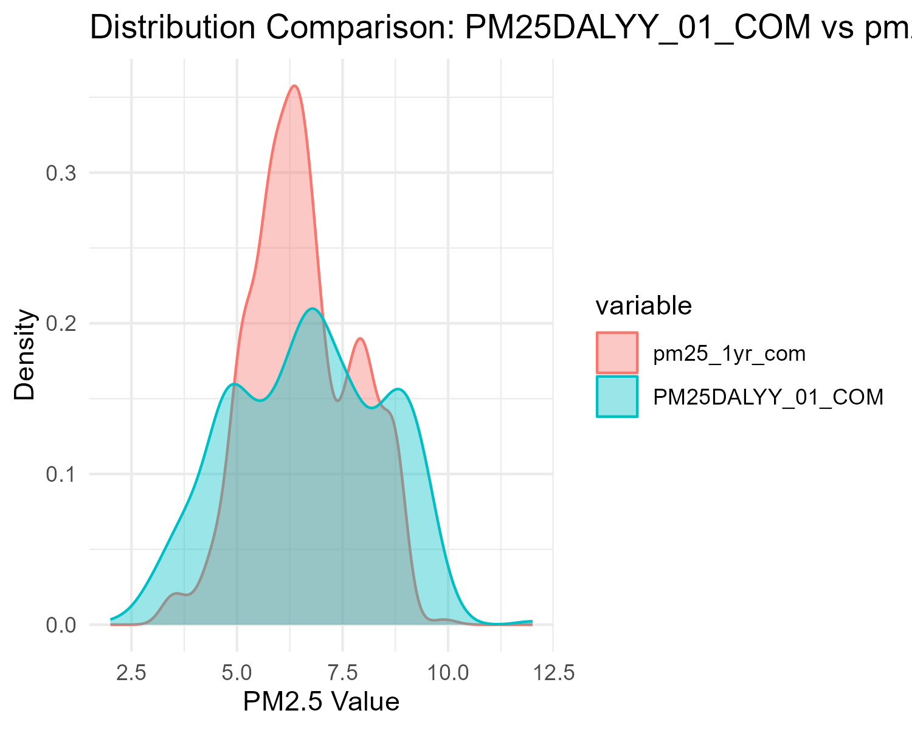
```

```{r figure_pm25_boxplot, echo=FALSE, fig.width=5, fig.height=4, out.width="80%", fig.cap="Figure X: Boxplot comparison of PM25DALYY_01_COM vs pm25_1yr_com."}
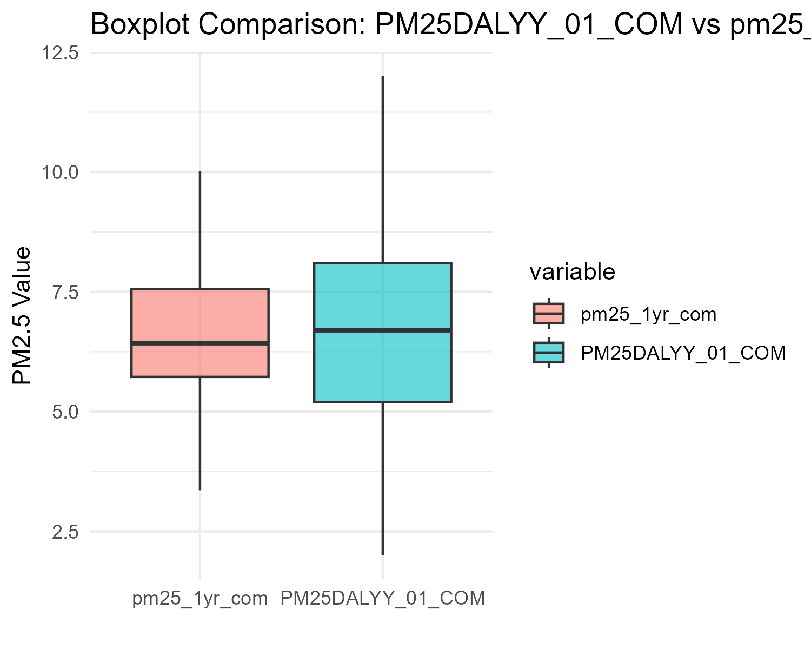
```

```{r figure_so2_density, echo=FALSE, fig.width=5, fig.height=4, out.width="80%", fig.cap="Figure X: Distribution comparison of so2_1yr_com vs SO2OMIYY_COM."}
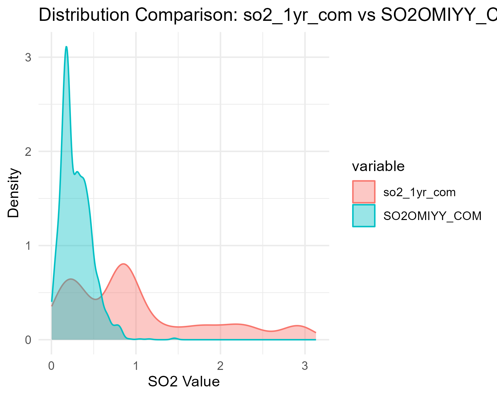
```

```{r figure_so2_boxplot, echo=FALSE, fig.width=5, fig.height=4, out.width="80%", fig.cap="Figure X: Boxplot comparison of so2_1yr_com vs SO2OMIYY_COM."}
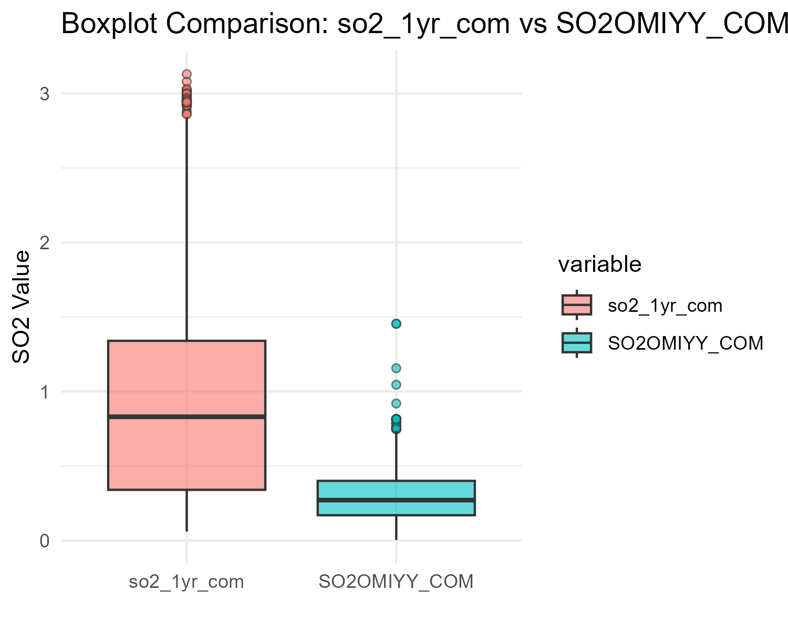
```

```{r figure_o3_density, echo=FALSE, fig.width=5, fig.height=4, out.width="80%", fig.cap="Figure X: Distribution comparison of O3CHGYY_01_COM vs o3_1yr_com."}
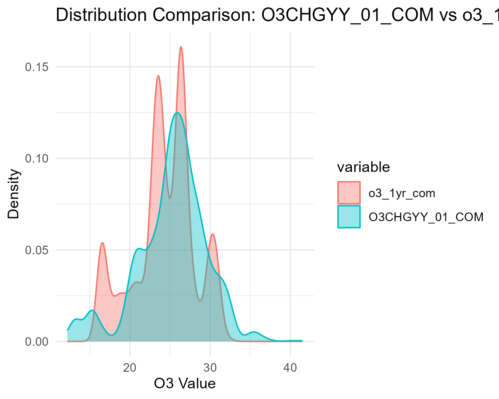
```

```{r figure_o3_boxplot, echo=FALSE, fig.width=5, fig.height=4, out.width="80%", fig.cap="Figure X: Boxplot comparison of O3CHGYY_01_COM vs o3_1yr_com."}
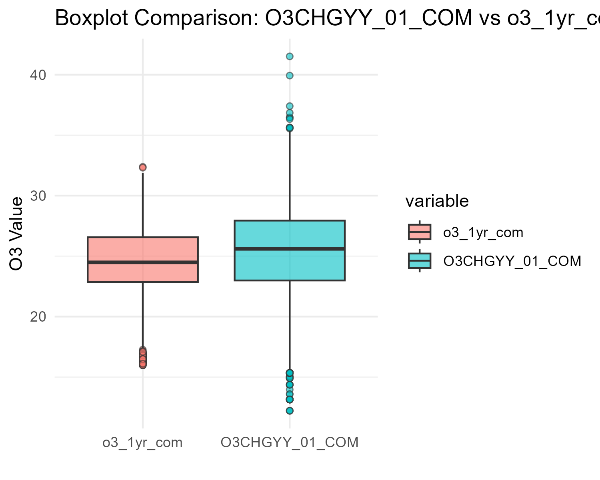
```


<br>
<br>


### Housing problems: Condensation and noise 

"Home problems: Condensation" measures if current home has problems with condensation (Yes or No). 
"Home problems: Noise measures" if current home has problems with noise (Yes or No). 

```{r table_housing, echo=FALSE, fig.width=8,fig.height=5,out.width="100%"}
knitr::include_graphics("Tables/Table_housing.png")
```

<br>
<br>


```{r figure_condensationbarplot, echo=FALSE, fig.width=5,fig.height=3,out.width="80%",fig.cap="Figure X: Distribution of condensation problems in home."}
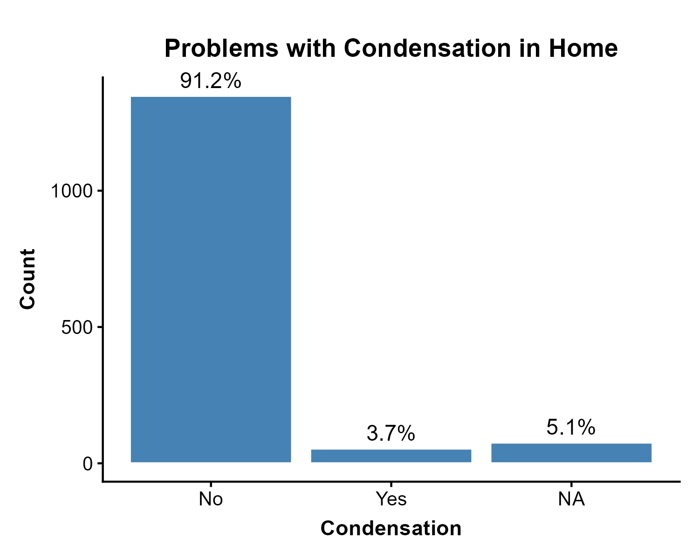
```


```{r figure_noisebarplot, echo=FALSE, fig.width=5,fig.height=3,out.width="80%",fig.cap="Figure X: Distribution of noise problems in home."}
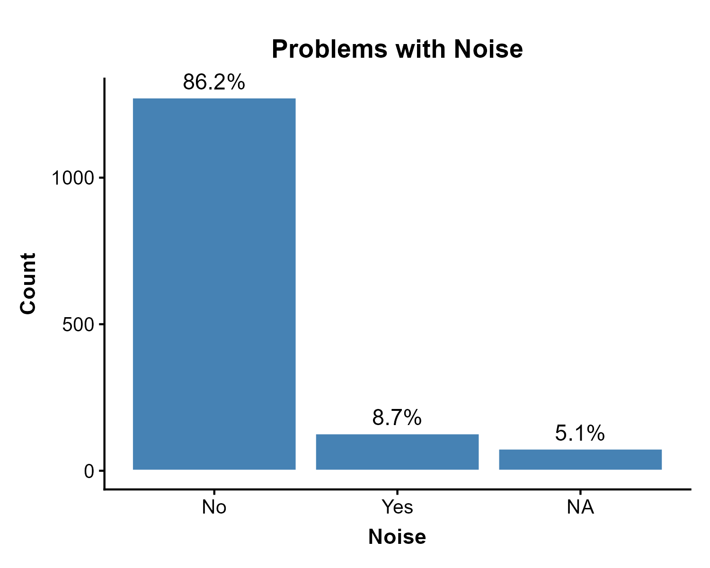
```


### Tree canopy coverage 

Tree canopy is defined as area of vegetation (including leaves, stems, branches, etc.) of woody plants above 5m in height. The dataset developers derived tree canopy cover estimates from the Global Forest Cover Change (GFCC) Surface Reflectance product (GFCC30SR), which is based on enhanced Global Land Survey (GLS) datasets. The GLS datasets are composed of high-resolution Landsat 5 Thematic Mapper (TM) and Landsat 7 Enhanced Thematic Mapper Plus (ETM ) images at 30 meter resolution.CANUE staff retrieved tree canopy cover data from Google Earth Engine (GEE) for the year 2010 and 2015, extracted values (percent coverage) to postal codes and calculated summary measures (average percent coverage) within buffers of 100, 250, 500, and 1000 metres. Source: [CANUE metadata](https://www.canuedata.ca/metadata.php)

Tree canopy coverage estimates in this dataset are associated with postal code. However, postal codes are an imperfect proxy for residential location, as coordinates are assigned to area centroids rather than specific addresses. Given that a single postal code may encompass a considerable geographic area, there is potential for exposure misclassification if a participant's true residence deviates substantially from the assigned centroid [@khanPositionalAccuracyGeocoding2018].

The appropriate buffer size for measuring greenspace exposure depends on the specific health pathway under investigation. For example, smaller buffers may better capture mechanisms related to mental health, while larger buffers may be more relevant for outcomes related to physical activity [@sakhvidiMethodologicalGuidanceSelecting2025].


```{r table_treecanopy, echo=FALSE, fig.width=8,fig.height=5,out.width="100%"}
knitr::include_graphics("Tables/Table_treecanopy.png")
```

<br>
<br>


The following dashboard shows Tree Canopy Coverage at varying distances from postal code.

```{r figure_treecanopycoverage_histograms, echo=FALSE, fig.width=5,fig.height=3,out.width="100%",fig.cap="Figure X: Tree Canopy Coverage Distributions."}
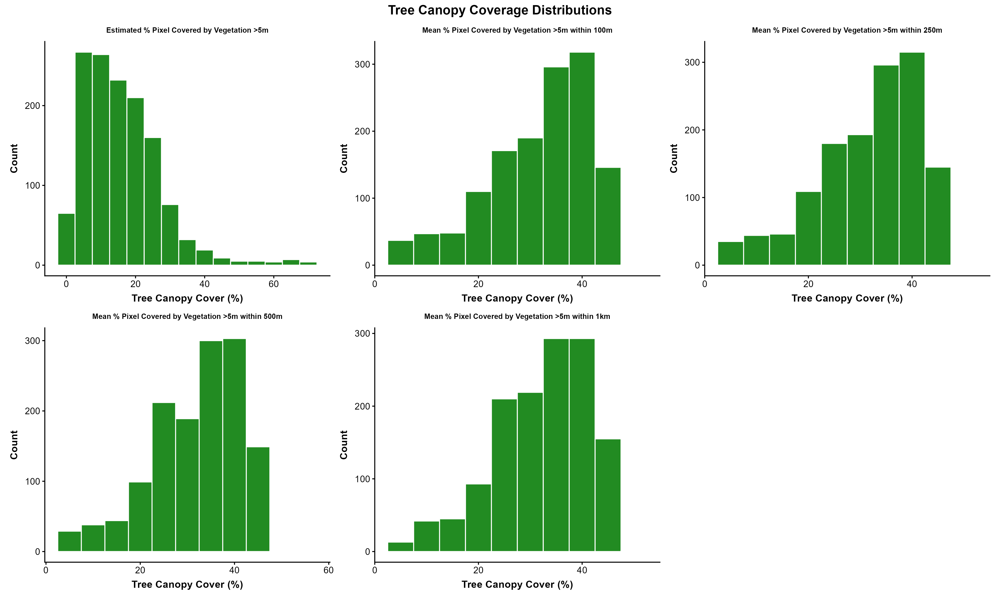
```


### Vegetative greenness fractions

Vegetative greenness fraction measures the proportion of green vegetation visible within each 30 m satellite pixel, derived from Landsat imagery spanning 1984–2016. Because the measure captures everything within a pixel, the presence of roads, buildings, and other built structures can reduce greenness values even in areas with tree cover, making it a broader indicator of urban vegetation rather than canopy alone. Annual mean and maximum values were assigned to postal codes within buffers of 100, 250, 500, and 1000 metres around each postal code centroid [@canueDataPortal].


```{r table_percentveggreenness, echo=FALSE, fig.width=8, fig.height=5, out.width="100%"}
knitr::include_graphics("Tables/Table_percentveg.png")
```

<br>
<br>


The following dashboard shows percent vegetative greenness at different distances from postal code centre (both mean of annual and maximum of annual). 

```{r figure_%veggreeness, echo=FALSE, fig.width=5,fig.height=3,out.width="100%",fig.cap="Figure X: Percent vegetative greenness."}
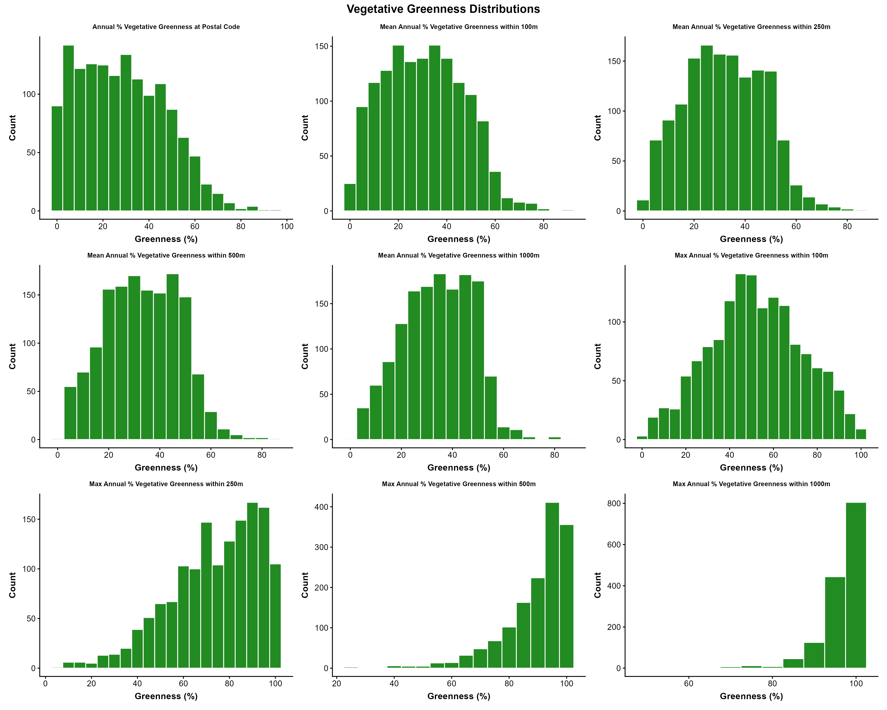
```


### NDVI 

Annual maximum NDVI calculated by Google from Landsat 5 and Landsat 8 were accessed via Google Earth Engine. These composites are created from all the scenes in each annual period beginning from the first day of the year and continuing to the last day of the year. All the images from each year are included in the composite, with the greenest pixel as the composite value, where the greenest pixel is the maximum value of the Normalized Difference Vegetation Index (NDVI). No data were available for 2012, due to decommissioning of Landsat 5 in 2011 prior to the start of Landsat 8 in 2013. No cross-calibration between the sensors was performed, please be aware there may be small bias differences between NDVI values calculated using Landsat 5 and Landsat 8. Final NDVI metrics were linked to all 6-digit DMTI Spatial single link postal code locations in Canada, and for surrounding areas within 100m, 250m, 500m, and 1km.
[CANUE metadata](https://www.canuedata.ca/metadata.php)

Looked at maximum of annual mean Normalized Difference Vegetation Index (NDVI) within 500m. 

```{r table_ndvi, echo=FALSE, fig.width=8,fig.height=5,out.width="100%"}
knitr::include_graphics("Tables/Table_ndvi.png")
```

<br>
<br>

```{r figure_NDVI500, echo=FALSE, fig.width=5,fig.height=3,out.width="80%",fig.cap="Figure X: Maximum Annual NDVI within 500m of postal code."}
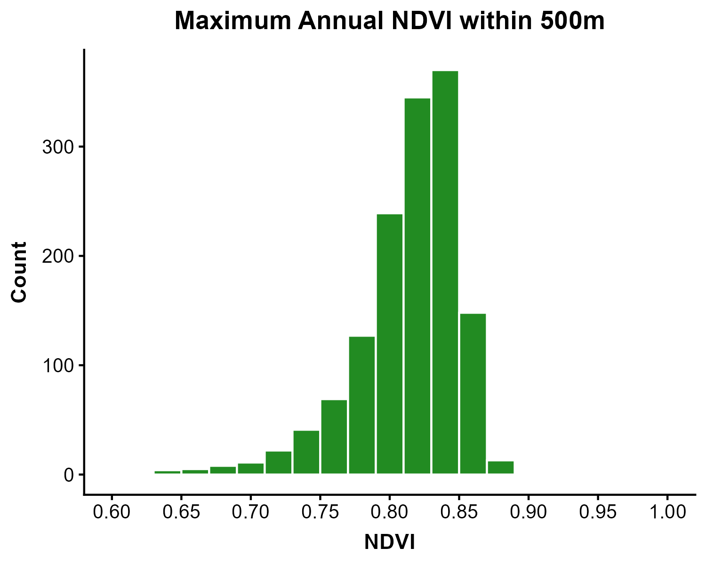
```


\newpage

## Outcomes 

\newpage


# 3 Environmental by income 

## Air pollution measures by Income 

### Measures that are averages of NAPS locations within 50 km 

```{r figure_airpollution_income_dashboard, echo=FALSE, fig.width=5,fig.height=3,out.width="110%",fig.cap="Figure X: Air pollution measures by income group."}
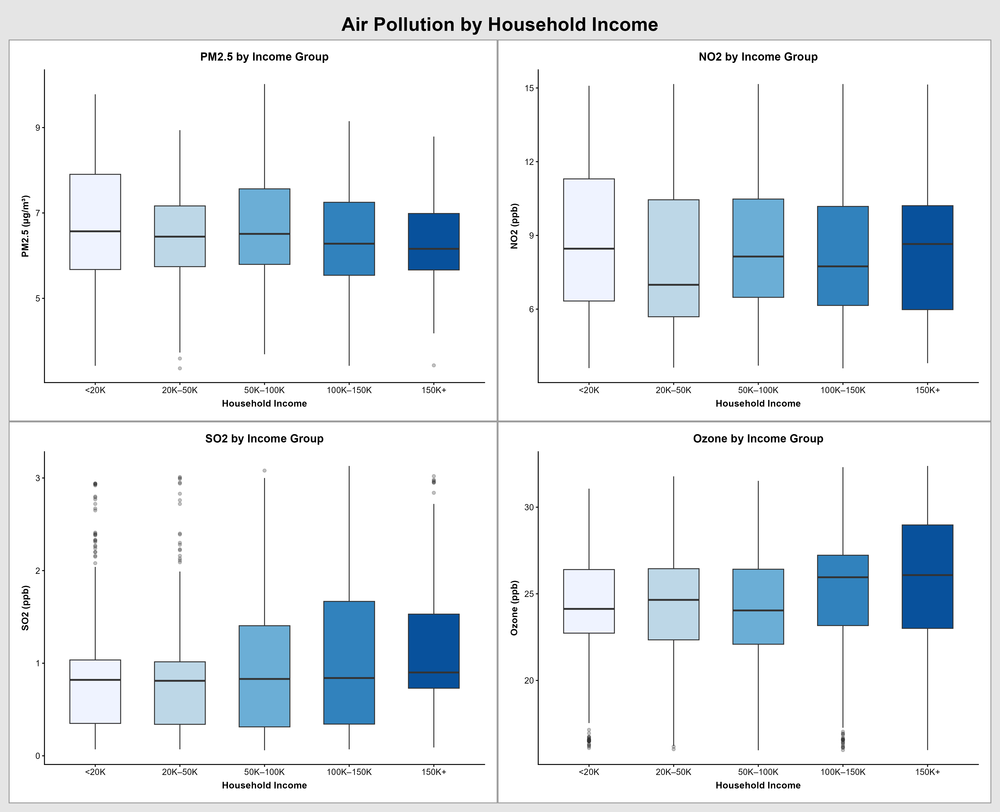
```

\newpage


### Measures that are satellite and model derived (more specific to participants' locations) 

```{r figure_boxplot_PM25DALYY_01_COM, echo=FALSE, fig.width=5, fig.height=4, out.width="100%"}
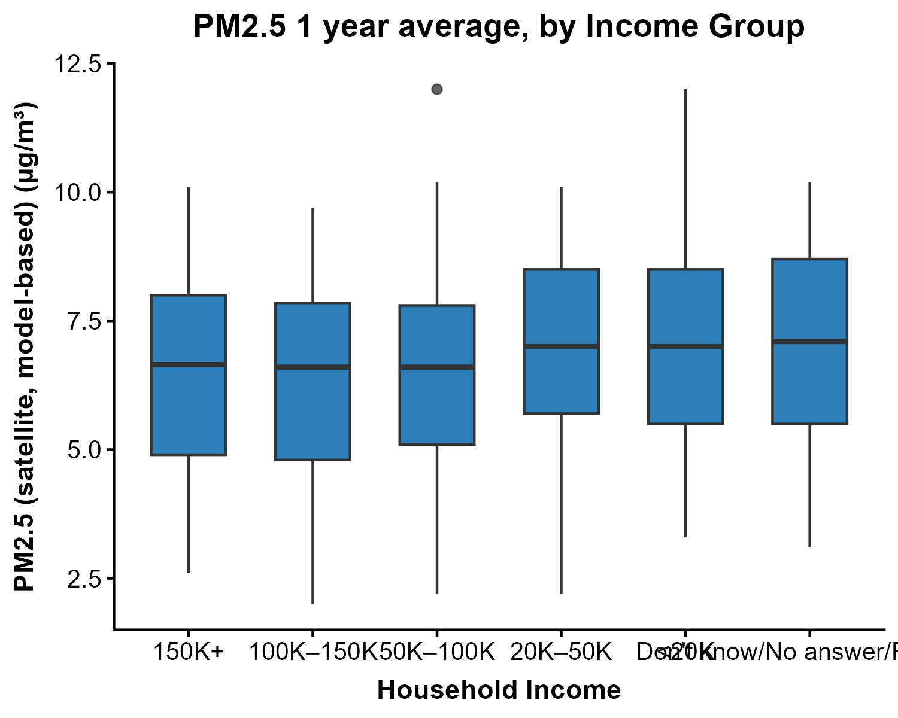
```

```{r figure_boxplot_SO2OMIYY_COM, echo=FALSE, fig.width=5, fig.height=4, out.width="100%"}
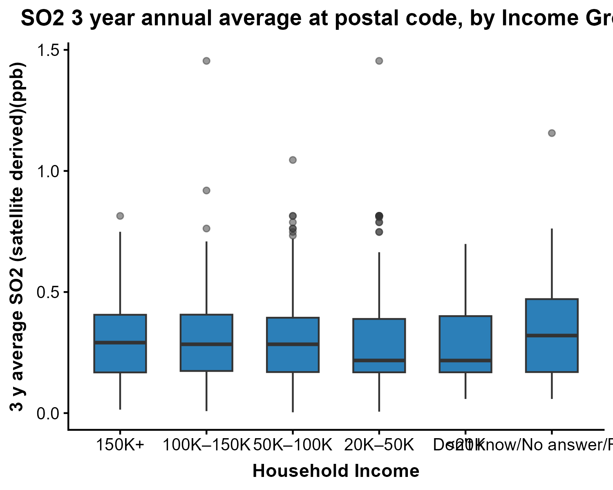
```

```{r figure_boxplot_O3CHGYY_01_COM, echo=FALSE, fig.width=5, fig.height=4, out.width="100%"}
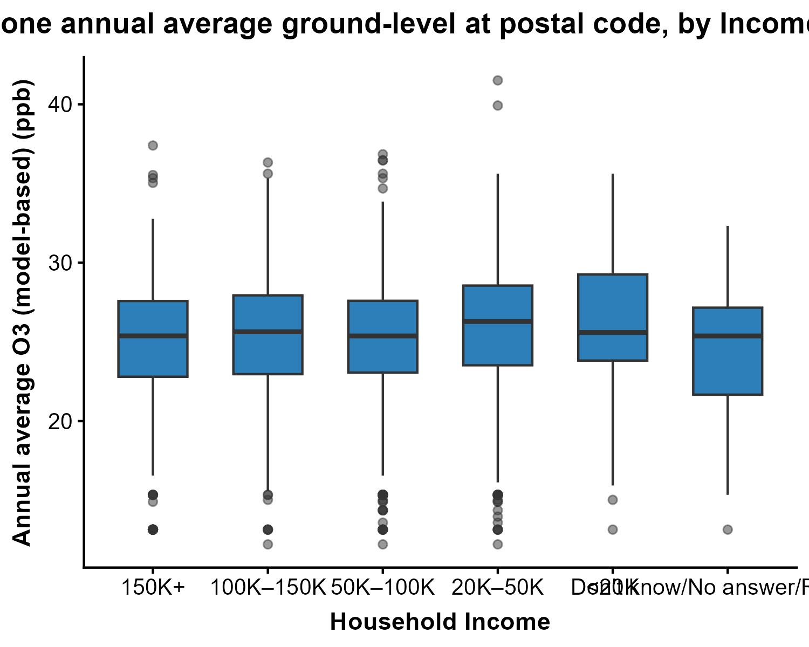
```

\newpage

## Air Pollution measures by wealth (total savings and investments) 

```{r figure_boxplot_PM25DALYY_01_COM_savings, echo=FALSE, fig.width=5, fig.height=4, out.width="100%"}
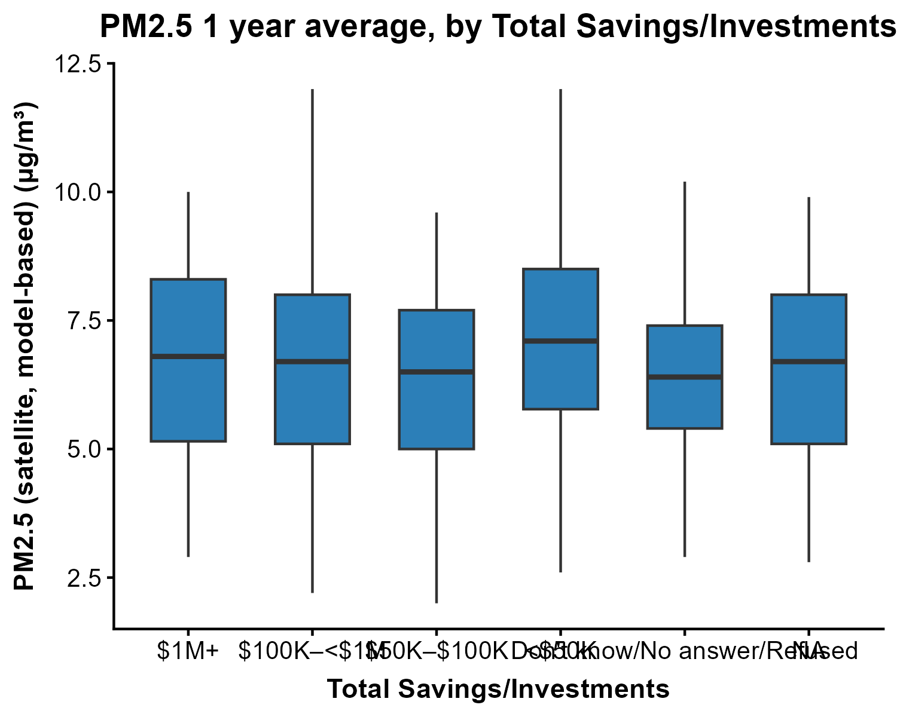
```

```{r figure_boxplot_SO2OMIYY_COM_savings, echo=FALSE, fig.width=5, fig.height=4, out.width="100%"}
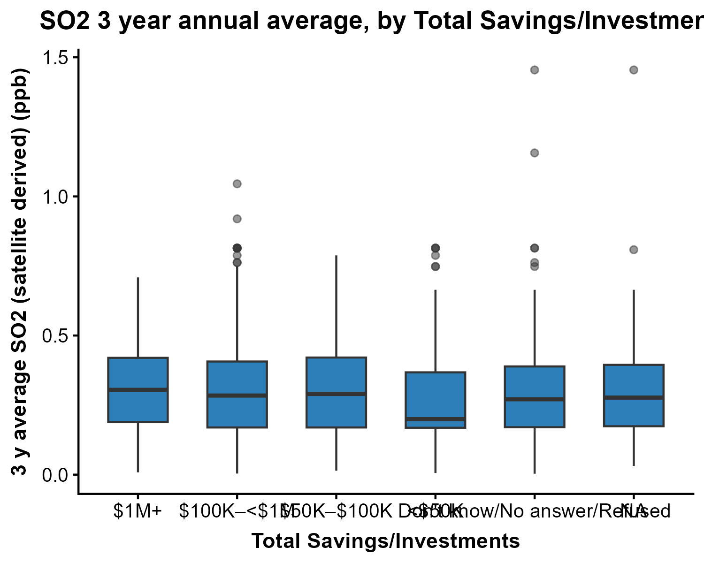
```

```{r figure_boxplot_O3CHGYY_01_COM_savings, echo=FALSE, fig.width=5, fig.height=4, out.width="100%"}
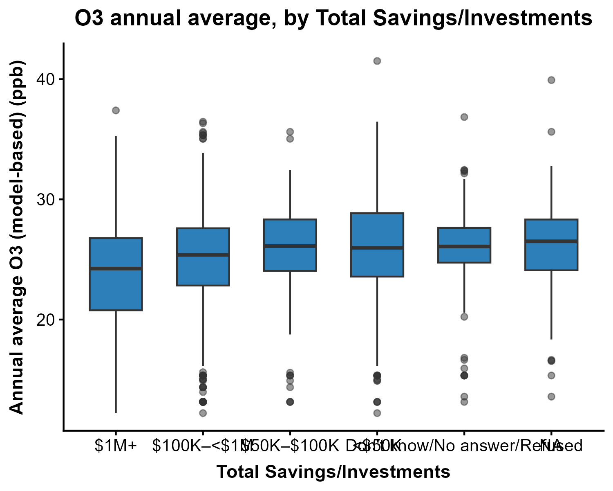
```


\newpage

## Condensation problems by Income Group 

54 participants had homes with condensation problems, while 1348 participants did not. The following figure shows the income distribution of participants who had condensation problems. 

```{r figure_condensation, echo=FALSE, fig.width=5,fig.height=3,out.width="80%",fig.cap="Figure X: Number of homes with condensation by household income group"}
knitr::include_graphics("Figures/barplot_condensation.png")
```


## Tree Canopy Coverage By Income Group 


Figures X–X show tree canopy coverage (vegetation >5m) by household income group across five spatial buffers (postal code, 100m, 250m, 500m, and 1km). Across all buffer sizes, the distribution of vegetation coverage was similar across income groups, with median values and interquartile ranges showing no consistent gradient. These findings suggest that in this sample of Canadian urban dwellers, tree canopy coverage is not meaningfully stratified by household income.

```{r figure_veg01, echo=FALSE, fig.width=5, fig.height=4, out.width="80%", fig.cap="Figure X: Vegetation cover (>5m) by income group"}
knitr::include_graphics("Figures/boxplot_vegetation_01.png")
```

```{r figure_veg02, echo=FALSE, fig.width=5, fig.height=4, out.width="80%", fig.cap="Figure X: Vegetation cover (>5m) by income group, within 100m"}
knitr::include_graphics("Figures/boxplot_vegetation_02.png")
```

```{r figure_veg03, echo=FALSE, fig.width=5, fig.height=4, out.width="80%", fig.cap="Figure X: Vegetation cover (>5m) by income group, within 250m"}
knitr::include_graphics("Figures/boxplot_vegetation_03.png")
```

```{r figure_veg04, echo=FALSE, fig.width=5, fig.height=4, out.width="80%", fig.cap="Figure X: Vegetation cover (>5m) by income group, within 500m"}
knitr::include_graphics("Figures/boxplot_vegetation_04.png")
```

```{r figure_veg05, echo=FALSE, fig.width=5, fig.height=4, out.width="80%", fig.cap="Figure X: Vegetation cover (>5m) by income group, within 1km"}
knitr::include_graphics("Figures/boxplot_vegetation_05.png")
```


## Vegetative greenness fractions by income 

There is no pattern in vegetative greenness fraction by income group. The values are all clustered between 26–31%. This variable measures all green vegetation including grass, shrubs, parks. 


```{r table_vegetative_greenness_fraction, echo=FALSE, fig.width=8, fig.height=5, out.width="100%"}
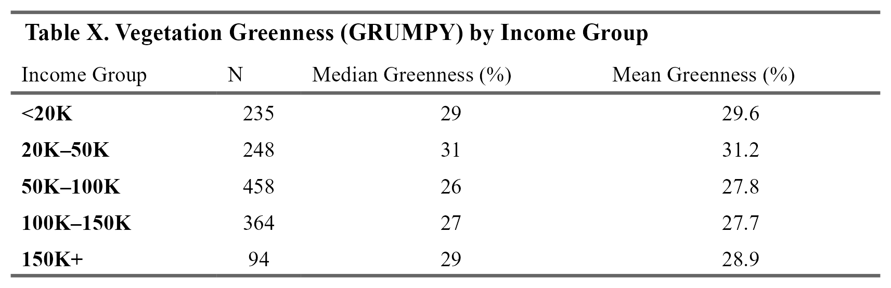
```


## NDVI (Greenness) by Income Group 


```{r figure_ndvi, echo=FALSE, fig.width=5,fig.height=3,out.width="80%",fig.cap="Figure X: Maximum NDVI within 500 m by household income group"}
knitr::include_graphics("Figures/NDVI_by_income_group.png")
```


# Linear regressions 
## Income predicting aging 

```{r table_income, echo=FALSE, out.width="100%", fig.cap="Table X: Association between household income and epigenetic aging, stratified by age group"}
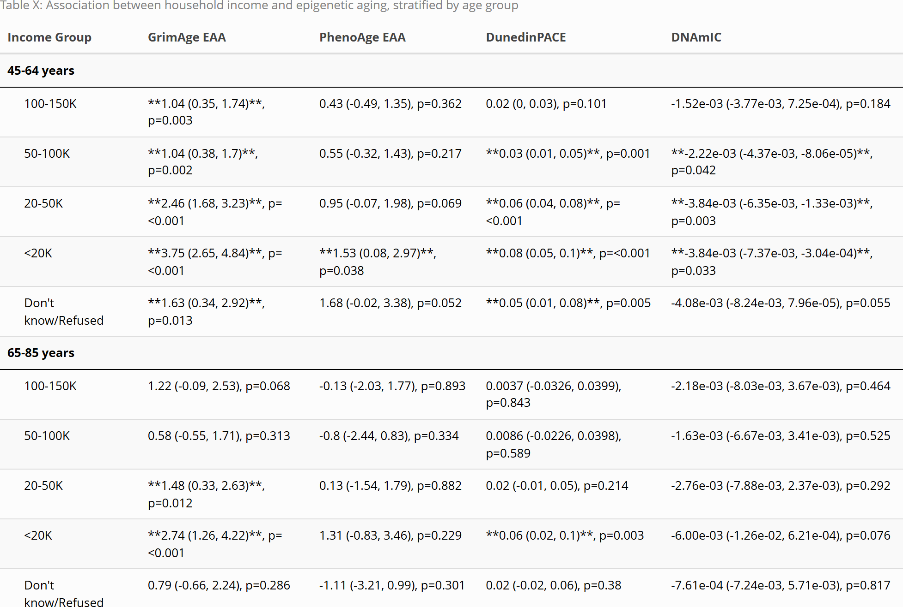
```

<br>
<br>

Note: Reference category: $150,000+. Results are beta coefficients and 95% CI from linear regression models adjusted for sex, age, age-squared, province, ethnicity, and cell type composition. Bold indicates p < 0.05. GrimAge EAA = GrimAge epigenetic age acceleration; PhenoAge EAA = PhenoAge epigenetic age acceleration; DunedinPACE = pace of biological aging; DNAmIC = DNA methylation immune age.


\newpage


# To do: 

outcome variable descriptive stats 


 


# Likely delete 
All of the air pollution variables are 1 year averages prior to the first interview date, and are averages of National Air Pollution Surveillance station (NAPS) locations within 50 km. 
PM2.5 is measured in microgram/m$^3$. The other air pollution variables are measured in parts per billion (ppb). 


```{r table_airquality, echo=FALSE, fig.width=8,fig.height=5,out.width="100%"}
knitr::include_graphics("Tables/Table_airquality.png")
```

```{r figure_airpollutiondashboard, echo=FALSE, fig.width=5,fig.height=3,out.width="100%",fig.cap="Figure X: Air pollution distributions."}
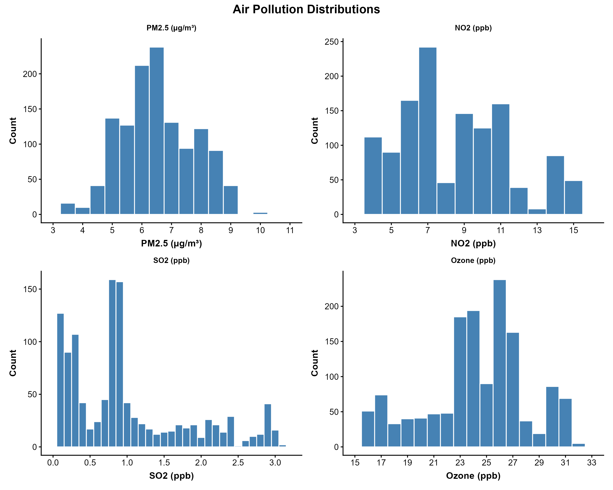
```


### 2.3.6 Length of roads within varying distances of postal code center

length of local/major roads within 200 m of 6 digit postal code center (2013)
length of primary highway/expressway within 200 m of 6 digit postal code center (2013)

```{r table_roads, echo=FALSE, fig.width=8,fig.height=5,out.width="100%"}
knitr::include_graphics("Tables/Table_roads.png")
```

<br>
<br>


<br><br><br>

The figure below shows PM2.5 median by income group, which more clearly shows a trend, though the differences within PM2.5 exposure appear small. However, the World Health Organization PM2.5 annual air quality guideline level is 5 ug/m3, as effects can occur at lower levels of exposure. https://iris.who.int/server/api/core/bitstreams/551b515e-2a32-4e1a-a58c-cdaecd395b19/content
Knowing this, even small differences in this exposure could make a difference in health impacts. 


```{r figure_PM25median_dot_plot, echo=FALSE, fig.width=8,fig.height=5,out.width="100%"}
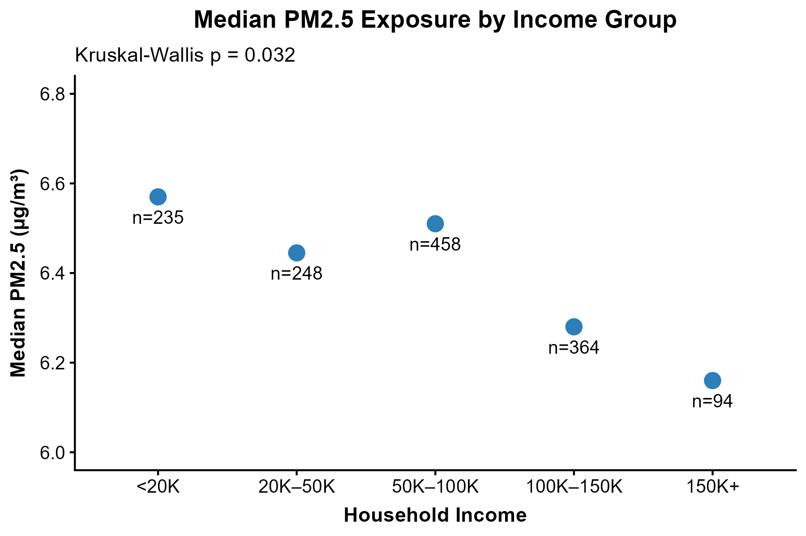
```


# References


\newpage
