```{r, echo = FALSE, warning = FALSE}
library(knitr)
knitr::opts_chunk$set(
  dpi = 300
)
```

\newpage

# 1.0 Description of Study and Sample 

## 1.1 CLSA and CANUE data  

The Canadian Longitudinal Study on Aging (CLSA) is a longitudinal cohort study that recruited 51,338 community-based individuals (n = 30,097 Comprehensive cohort and n = 21,241 Tracking cohort) aged 45–85 years [@rainaCohortProfileCanadian2019]. It excludes people living in nursing homes, on First Nations reserves, and in the Canadian territories, full-time members of the armed forces, people unable to respond in English or French, and people with significant cognitive impairment precluding participation without a proxy respondent. 
The participants for the comprehensive cohort were recruited from within 25–50 km of 11 data collection sites across 7 Canadian provinces: British Columbia (Surrey, Victoria, Vancouver), Alberta (Calgary), Manitoba (Winnipeg), Ontario (Hamilton, Ottawa), Quebec (Montréal, Sherbrooke), Nova Scotia (Halifax) and Newfoundland and Labrador (St. John). They were interviewed in person and had physical assessments done, and provided blood and urine samples.

The environmental variables come from the Canadian Urban Environmental Health Research Consortium (CANUE), an initiative to collect and develop standard measures for environmental exposure data and link them to health databases in Canada. The CLSA and CANUE collaborated in 2018 to link data to provide information on environmental factors that may influence aging. The linked CANUE data include estimated exposures of sulfur dioxide, nitrogen dioxide, ozone and fine particulate matter, nighttime light, normalized difference vegetation index (i.e. greenness), weather and climate ([CLSA, 2018](https://www.clsa-elcv.ca/clsa-links-with-canue-to-release-data-on-environmental-health-cihr-announces-funding-opportunity/)).


## 1.2 DNA methylation data 

For DNA methylation profiling, 23,492 Comprehensive cohort participants provided baseline blood and urine samples, including EDTA whole blood and buffy coat [@zotero-item-786]. Of these 23,492 participants, 6,268 had fasted for at least 5 hours, and 3,000 of them were selected for genomics and metabolomics analyses. Additionally, from the remaining 20,492 participants, 7,000 were selected. From these 10,000 participants, a sub-sample of 1,500 was chosen for epigenetic analysis, of which 1,478 were successfully assayed. Sample selections were made to match the distribution of Comprehensive cohort by age, sex, and data collection site (Lin et al. 2022). 

DNAm PhenoAge was calculated following the method described by Levine et al. (reference). DNA methylation β‑values (percent methylation) were obtained for each of the 513 CpG sites included in the PhenoAge model. Each β‑value was multiplied by its corresponding weight from Levine’s model, and the weighted values were then summed. The intercept from the model was added to this sum, resulting in the DNAm PhenoAge estimate in years. 

Epigenetic age acceleration (EAA) for DNAm PhenoAge was then calculated using a linear regression of DNAm PhenoAge (dependent variable) on chronological age (independent variable). The residuals from this regression represent EAA: a positive residual means an individual’s epigenetic age is higher than expected for their chronological age (faster aging), while a negative residual means it is lower than expected (slower aging). Because the regression is done within this specific study group, EAA values show how an individual’s aging compares to others in the same cohort.

# 2.0 Descriptive Statistics

## 2.1 Demographics: Age, sex, and ethnicity 

Participants were 49.5% male and 50.5% female. The median age was 62 years old. The majority of participants self-reported their cultural background as White (95%). 

```{r figure_ethnicity, echo=FALSE, fig.width=5,fig.height=3,out.width="80%",fig.cap="Figure X: Participant's self-reported cultural background."}
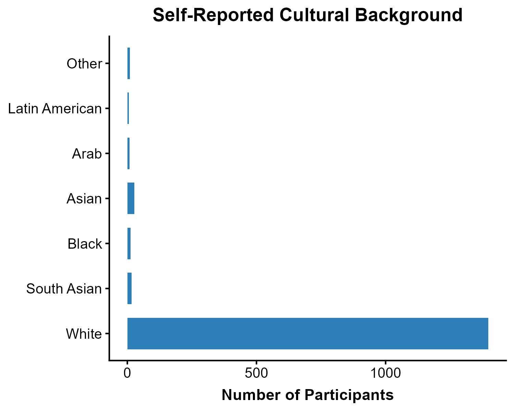
```

\newpage

## 2.2 Socioeconomic conditions: Household income and savings 

Household income was most commonly reported in the \$50,000–\$99,999 range (31.0%), followed by \$20,000–\$49,999 (24.6%), \$100,000–\$149,999 (16.8%), and \$150,000 or more (15.9%). Smaller proportions reported incomes below \$20,000 (6.4%), or did not report income (5.3%).

```{r figure_income, echo=FALSE, fig.width=5,fig.height=3,out.width="80%",fig.cap="Figure X: Estimate of total household income received by all household members, from all sources, before taxes and deductions, in the past 12 months."}
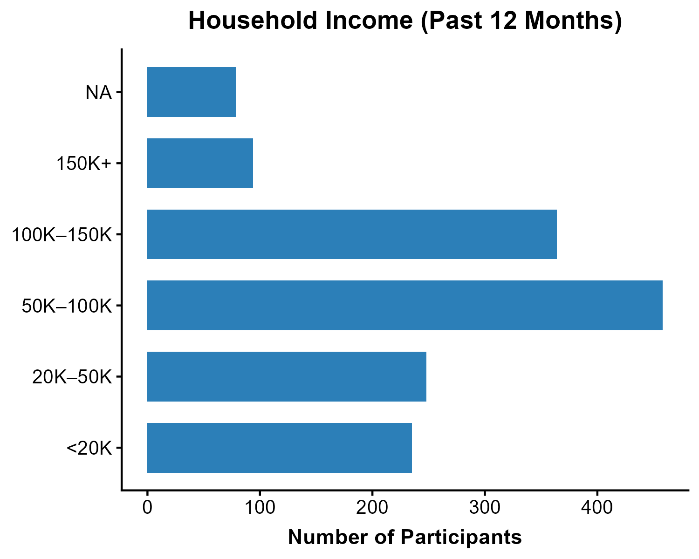
```

\newpage

Savings and investment levels varied across participants. The most commonly reported category was \$100,000 to less than \$1 million (40.2%), followed by less than \$50,000 (21.4%) and \$50,000–\$100,000 (13.0%). Smaller proportions reported savings of \$1 million or more (9.5%) or selected Don't know/No answer/Refused (8.9%), while 7.0% of savings data were missing.

```{r figure_savings, echo=FALSE, fig.width=5,fig.height=3,out.width="80%",fig.cap="Figure X: Approximate total value of savings and investments, including bank accounts, RRSPs, and financial investments."}
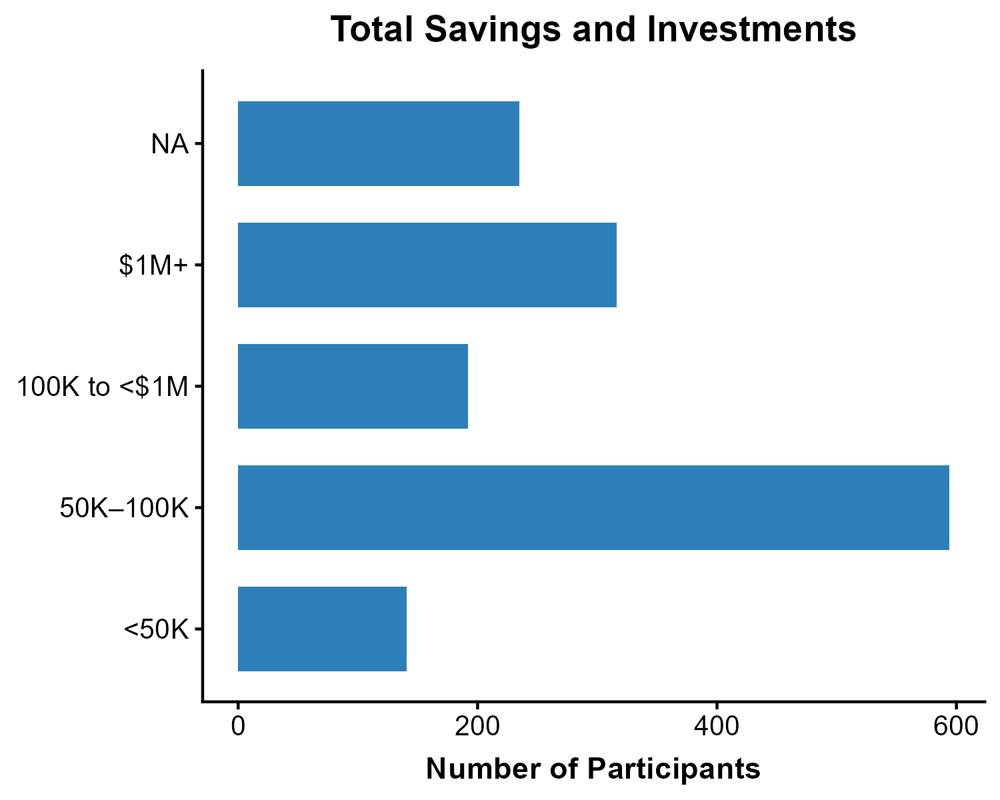
```


## 2.3 Environmental Exposure variables 

### 2.3.1 Air pollution 

All of the air pollution variables are 1 year averages prior to the first interview date, and are averages of National Air Pollution Surveillance station (NAPS) locations within 50 km. 
PM2.5 is measured in microgram/m$^3$. The other air pollution variables are measured in parts per billion (ppb). 


```{r table_airquality, echo=FALSE, fig.width=8,fig.height=5,out.width="100%"}

```

<br>
<br>

### 2.3.2 Greenness (NDVI)

Maximum of annual mean Normalized Difference Vegetation Index (NDVI) within 250m. Range is -1 to + 1.


```{r table_ndvi, echo=FALSE, fig.width=8,fig.height=5,out.width="100%"}

```

<br>
<br>


### 2.3.3 Housing problems: Condensation and noise 

"Home problems: Condensation" measures if current home has problems with condensation (Yes or No). 
"Home problems: Noise measures" if current home has problems with noise (Yes or No). 

```{r table_housing, echo=FALSE, fig.width=8,fig.height=5,out.width="100%"}

```

<br>
<br>

### 2.3.4 Length of roads within certain distances 

length of local/major roads within 200 m of 6 digit postal code center (2013)
length of primary highway/expressway within 200 m of 6 digit postal code center (2013)

```{r table_roads, echo=FALSE, fig.width=8,fig.height=5,out.width="100%"}

```

<br>
<br>

### 2.3.5 Tree canopy coverage and vegetative greenness fractions

Tree canopy is defined as area of vegetation (including leaves, stems, branches, etc.) of woody plants above 5m in height. CANUE staff retrieved tree canopy cover data from Google Earth Engine (GEE) for the year 2010 and 2015, extracted values (percent coverage) to postal codes and calculated summary measures (average percent coverage) within buffers of 100, 250, 500, and 1000 metres.https://www.canuedata.ca/metadata.php


```{r table_treecanopy, echo=FALSE, fig.width=8,fig.height=5,out.width="100%"}

```

<br>
<br>

Vegetative greenness fractions: Users can interpret values as the percentage of green vegetation within each 30 m by 30 m pixel, but vegetative greenness fraction values are an indication of both the area coverage and intensity (i.e., strength of spectral signal) of all green vegetation within a 30 m by 30 m pixel. For instance, built environment factors (e.g. housing, asphalt) as well as tree canopy are accounted for in analysis, and therefore the presence of roads and buildings underneath canopy can yield lower greenness values. Water pixels were masked out using the Statistics Canada 2016 census water boundary files. CANUE staff assigned values to postal codes (1984-2016) as annual metrics and by calculating the mean and maximum of pixel level greenness within buffers of 100, 250, 500, and 1000 m. https://www.canuedata.ca/metadata.php

## 2.4 Aging Outcomes 


```{r table_percentveggreenness, echo=FALSE, fig.width=8, fig.height=5, out.width="100%"}

```

\newpage

# 3.0 Environmental variables by income 

## 3.1 Air Pollution by Income Group 

All of the air pollution variables are 1 year averages prior to the first interview date, and are averages of National Air Pollution Surveillance station (NAPS) locations within 50 km. 
PM2.5 is measured in microgram/m$^3$. The other air pollution variables are measured in parts per billion (ppb). 

```{r figure_PM2.5, echo=FALSE, fig.width=5,fig.height=3,out.width="80%",fig.cap="Figure X: Annual average PM2.5 by household income group"}
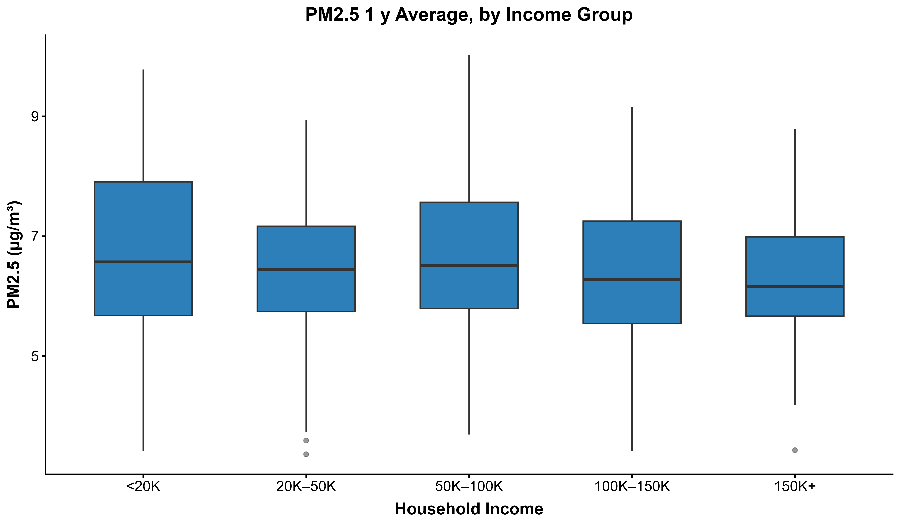
```

\newpage

```{r figure_no2, echo=FALSE, fig.width=5,fig.height=3,out.width="80%",fig.cap="Figure X: Annual average NO2 concentration by household income group"}
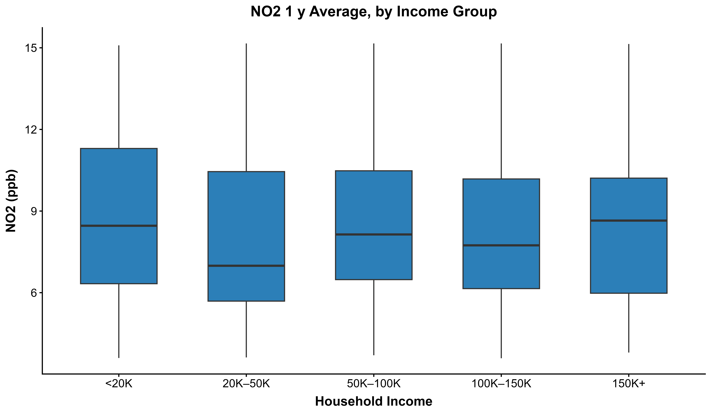
```

\newpage

```{r figure_so2, echo=FALSE, fig.width=5,fig.height=3,out.width="80%",fig.cap="Figure X: Annual average SO2 concentration by household income group"}
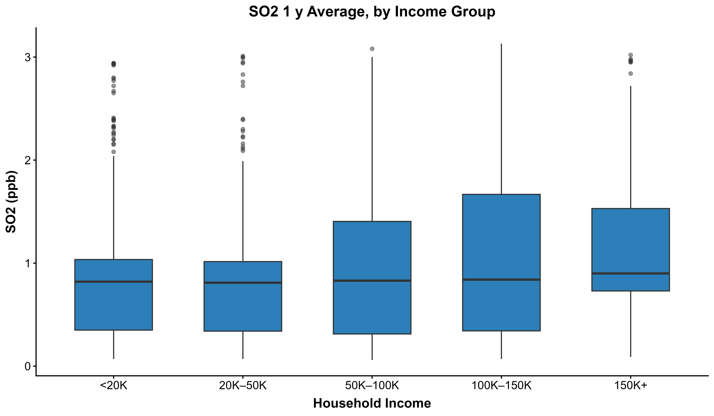
```

\newpage

```{r figure_ozone, echo=FALSE, fig.width=5,fig.height=3,out.width="80%",fig.cap="Figure X: Annual average Ozone concentration by household income group"}
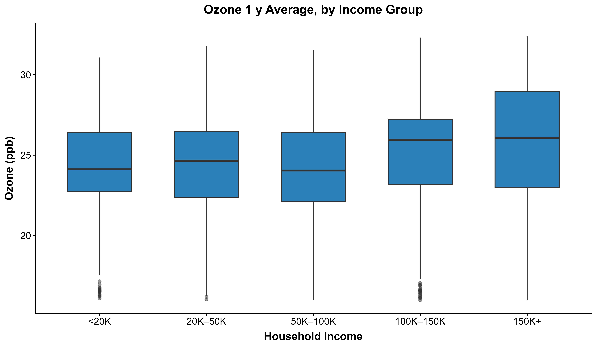
```


## 3.2 NDVI (Greenness) by Income Group 


```{r figure_ndvi, echo=FALSE, fig.width=5,fig.height=3,out.width="80%",fig.cap="Figure X: Maximum NDVI within 500 m by household income group"}
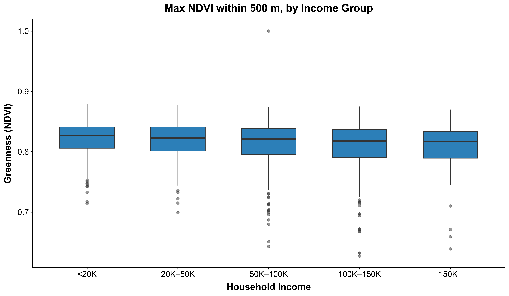
```


\newpage

## 3.3 Condensation problems by Income Group 

54 participants had homes with condensation problems, while 1348 participants did not. The following figure shows the income distribution of participants who had condensation problems. 

```{r figure_condensation, echo=FALSE, fig.width=5,fig.height=3,out.width="80%",fig.cap="Figure X: Number of homes with condensation by household income group"}
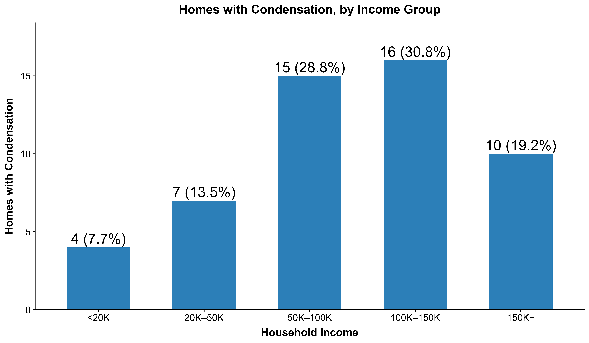
```


## 3.4 Tree Canopy Coverage By Income Group 

```{r figure_veg01, echo=FALSE, fig.width=5, fig.height=4, out.width="80%", fig.cap="Figure X: Vegetation cover (>5m) by income group"}
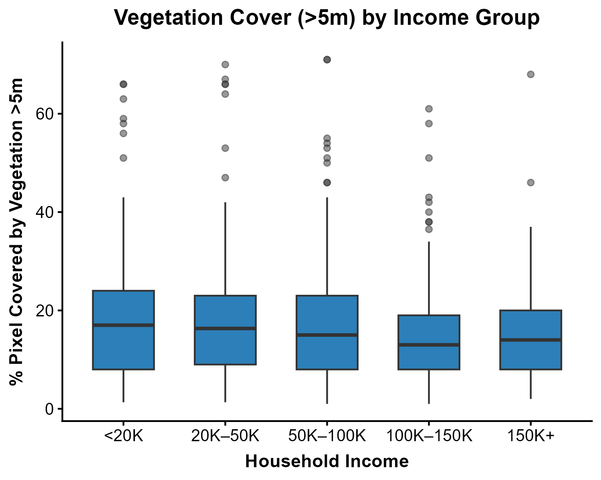
```

```{r figure_veg02, echo=FALSE, fig.width=5, fig.height=4, out.width="80%", fig.cap="Figure X: Vegetation cover (>5m) by income group, within 100m"}

```

```{r figure_veg03, echo=FALSE, fig.width=5, fig.height=4, out.width="80%", fig.cap="Figure X: Vegetation cover (>5m) by income group, within 250m"}
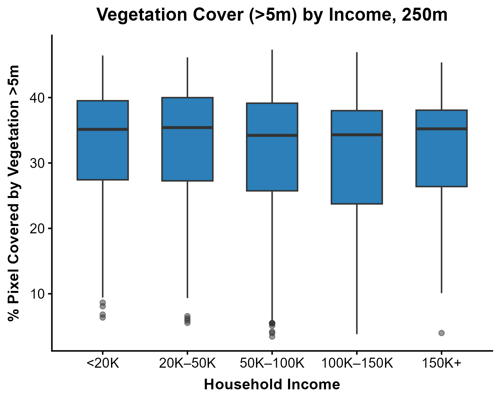
```

```{r figure_veg04, echo=FALSE, fig.width=5, fig.height=4, out.width="80%", fig.cap="Figure X: Vegetation cover (>5m) by income group, within 500m"}

```

```{r figure_veg05, echo=FALSE, fig.width=5, fig.height=4, out.width="80%", fig.cap="Figure X: Vegetation cover (>5m) by income group, within 1km"}
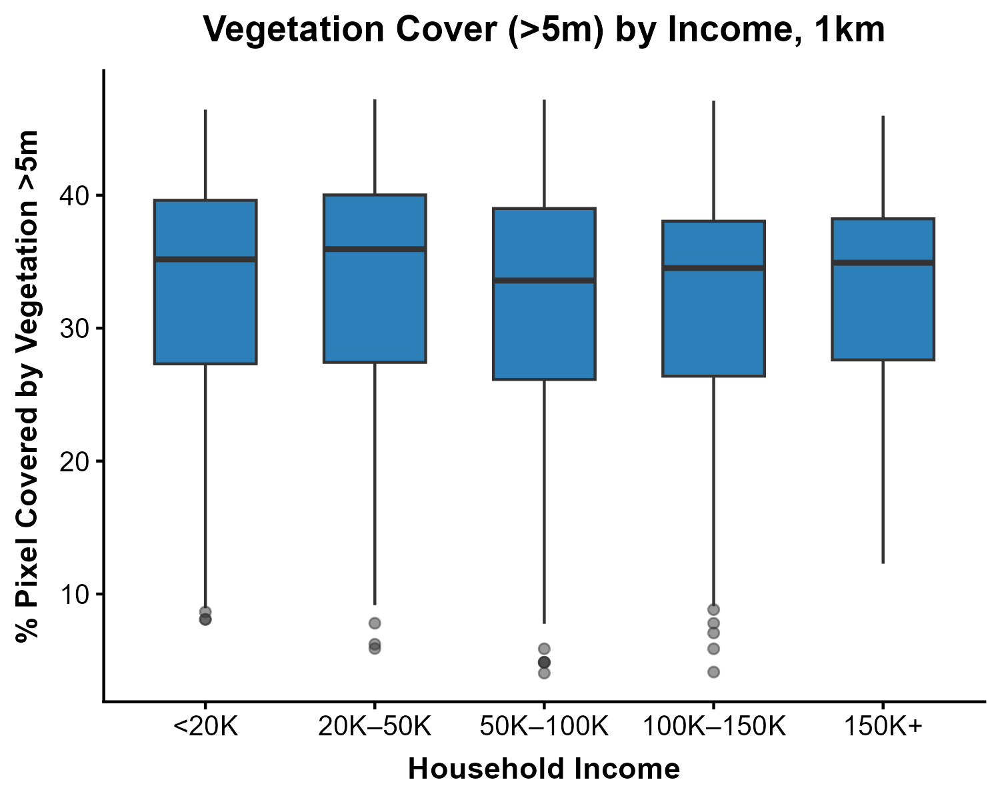
```


 


# References


\newpage
